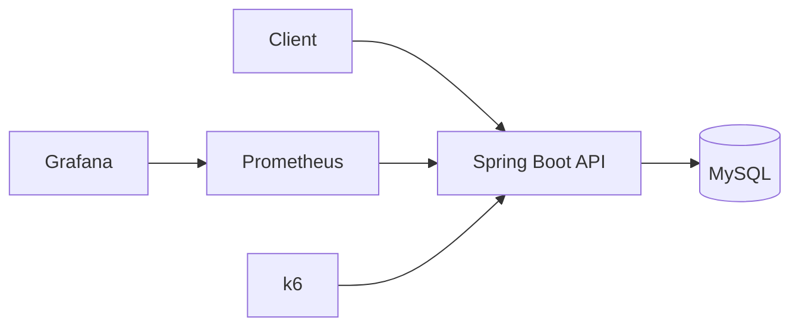
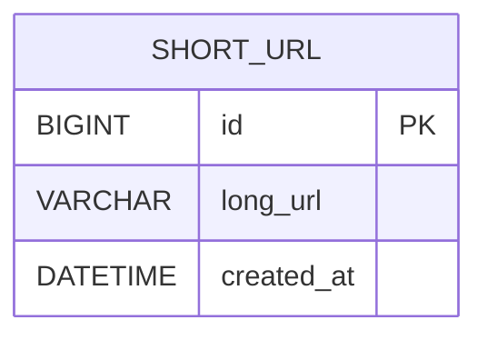

# 03. Architecture

## 1. 설계 목표

* 해결하려는 핵심 문제: 긴 URL을 고유한 단축 URL로 변환하고, 단축 URL 요청을 원본 URL로 리다이렉트한다.
* 가장 중요한 비기능 요구사항: 단축 코드 유일성, 읽기 성능, 확장 가능성
* 설계에서 우선한 요소: 단순한 초기 구조와 측정 가능한 베이스라인
* 감수한 트레이드오프: 초기에는 모든 조회 요청이 MySQL에 집중된다.
* 초기 코드 생성 전략: 순차 ID 기반 Base62
* 최종 코드 생성 전략: Hash 충돌 해소 및 난수 Base62 방식과 비교한 뒤 결정한다.

## 2. 전체 아키텍처



초기 구조에는 Redis와 Message Broker를 포함하지 않는다.

```text
요구사항 정의
→ MySQL 기반 구조 구현
→ 부하 테스트
→ 병목 분석
→ 구조 개선
→ 동일 조건 재측정
```

## 3. 주요 컴포넌트

| 컴포넌트       | 역할                | 확장 방법                           | 장애 영향       |
| ---------- | ----------------- | ------------------------------- | ----------- |
| API Server | URL 생성, 검증, 리다이렉트 | 무상태 서버 수평 확장                    | 요청 처리 불가    |
| MySQL      | 원본 URL 영구 저장      | Replica, Partitioning, Sharding | 생성 및 조회 불가  |
| Prometheus | 애플리케이션 지표 수집      | 현재는 단일 인스턴스                     | 성능 지표 수집 불가 |
| Grafana    | 성능 지표 시각화         | 현재는 단일 인스턴스                     | 대시보드 조회 불가  |
| k6         | 부하 테스트 실행         | VU 단계적 증가                       | 서비스에는 영향 없음 |

## 4. 요청 흐름

### URL 생성

1. 클라이언트가 긴 URL을 전달한다.
2. API 서버가 URL 형식과 프로토콜을 검증한다.
3. MySQL에 원본 URL을 저장한다.
4. MySQL에서 생성된 ID를 Base62로 변환한다.
5. 단축 URL을 반환한다.

### URL 리다이렉트

1. 클라이언트가 단축 코드로 요청한다.
2. API 서버가 Base62 코드를 숫자 ID로 변환한다.
3. MySQL에서 ID를 이용해 원본 URL을 조회한다.
4. 원본 URL을 `302 Found`로 반환한다.

### 실패 흐름

1. URL 형식이 잘못된 경우 `400 Bad Request`를 반환한다.
2. 단축 코드 형식이 잘못됐거나 데이터를 찾을 수 없으면 `404 Not Found`를 반환한다.
3. DB 연결에 실패하면 `503 Service Unavailable`을 반환한다.

## 5. 데이터 모델

### 주요 엔티티

| 엔티티      | 주요 필드                  | 설명                   |
| -------- | ---------------------- | -------------------- |
| ShortUrl | id, longUrl, createdAt | 원본 URL과 생성 정보를 저장한다. |

### 관계

현재는 단일 엔티티만 사용한다.



초기 구조에서는 단축 코드를 별도 컬럼에 저장하지 않는다.

```text
shortCode = Base62(id)
```

Redirect 요청에서는 단축 코드를 다시 ID로 변환해 Primary Key로 조회한다.

Hash와 난수 Base62 방식에서는 생성된 코드를 저장해야 하므로 이후 `short_code` 컬럼과 Unique Index를 사용하는 별도 구조를 적용한다.

## 6. API 설계

| Method | Endpoint       | 설명                | 멱등성 |
| ------ | -------------- | ----------------- | --- |
| POST   | `/api/v1/urls` | 긴 URL을 단축 URL로 변환 | No  |
| GET    | `/{shortCode}` | 원본 URL로 리다이렉트     | Yes |

동일한 원본 URL을 여러 번 요청하면 서로 다른 단축 URL이 생성될 수 있다.

## 7. 핵심 설계 결정

### 결정 1. 초기 구조에서 MySQL만 사용

#### 문제

읽기 요청이 많은 시스템이므로 캐시가 필요할 것으로 예상된다. 하지만 캐시를 처음부터 적용하면 개선 효과를 비교할 기준이 없다.

#### 선택

초기 구조는 Spring Boot와 MySQL만 사용한다.

#### 이유

DB Only 구조의 RPS, 응답 시간, DB 조회 수와 Connection Pool 사용량을 먼저 측정하기 위해서다.

#### 대안

Redis Cache-Aside를 처음부터 적용할 수 있다.

#### 트레이드오프

구조는 단순하고 베이스라인을 측정할 수 있지만, 모든 리다이렉트 요청이 MySQL에 집중된다.

### 결정 2. 초기 베이스라인으로 순차 ID 기반 Base62 사용

#### 문제

단축 코드는 짧고 중복되지 않아야 한다.

#### 선택

MySQL의 Auto Increment ID를 Base62로 변환한다.

#### 이유

충돌 확인 없이 코드를 생성할 수 있고, Base62 코드를 다시 ID로 변환해 Primary Key로 조회할 수 있다.

#### 대안

Hash 후 충돌 해소와 난수 Base62 방식을 이후 실험에서 비교한다.

#### 트레이드오프

코드 생성은 단순하고 빠르지만 다음 단축 코드를 예측하기 쉽다.

이 선택은 최종 코드 생성 전략을 의미하지 않는다. 다른 생성 방식과 동일한 조건으로 비교한 뒤 최종 전략을 결정한다.

또한 여러 DB가 독립적으로 ID를 발급하는 분산 환경에서는 ID 충돌과 Shard Routing 문제가 발생하므로, 전역 ID 생성기나 다른 코드 생성 전략이 필요하다.

### 결정 3. 302 Redirect 사용

#### 문제

영구 Redirect인 301과 임시 Redirect인 302 중 하나를 선택해야 한다.

#### 선택

초기 구현에서는 `302 Found`를 사용한다.

#### 이유

클라이언트 캐시의 영향을 줄이고 모든 요청이 서버를 통과하도록 해 부하 테스트가 쉽다.

#### 대안

301 Redirect를 별도 실험에서 비교한다.

#### 트레이드오프

Redirect 요청이 계속 서버에 전달되므로 301보다 서버 부하가 커질 수 있다.

## 8. 코드 생성 전략 비교

이번 프로젝트에서는 다음 세 가지 방식을 비교한다.

| 전략              | 생성 방식                          | 주요 확인 항목              |
| --------------- | ------------------------------ | --------------------- |
| Sequence Base62 | Auto Increment ID를 Base62로 변환  | 처리량, 조회 성능, 예측 가능성    |
| Hash 충돌 해소      | URL Hash를 Base62로 표현하고 7자리로 제한 | 충돌 수, DB 조회 수, 재시도 횟수 |
| Random Base62   | 난수 기반 고정 길이 코드 생성              | 충돌 수, 확장성, 예측 가능성     |

Hash 방식은 다음 순서로 동작한다.

```text
원본 URL
→ SHA-256 Hash
→ Hash 결과를 Base62로 표현
→ 7자리 코드 생성
→ 중복 확인
→ 충돌 시 다시 생성
```

초기 구현은 Sequence Base62로 진행하고, 이후 세 방식의 RPS, p95, DB 조회 수와 충돌 횟수를 비교한다.

## 9. 데이터 정합성

* 트랜잭션 범위: 원본 URL을 MySQL에 저장하는 단일 트랜잭션
* 동시성 제어: MySQL Auto Increment로 ID 유일성을 보장한다.
* 중복 요청 처리: 동일한 원본 URL의 중복 생성을 허용한다.
* 저장 실패 처리: DB 저장에 실패하면 단축 URL을 반환하지 않는다.
* DB와 캐시 간 정합성: 초기 구조에서는 캐시를 사용하지 않는다.

Hash와 난수 방식에서는 `short_code`에 Unique Constraint를 적용해 코드 중복을 방지한다.

## 10. 장애 대응

| 장애 상황         | 영향             | 감지 방법                   | 대응 방법              |
| ------------- | -------------- | ----------------------- | ------------------ |
| API 서버 장애     | URL 생성 및 조회 불가 | Health Check, HTTP 오류율  | 서버 재시작, 향후 다중 인스턴스 |
| DB 장애         | URL 생성 및 조회 불가 | Connection 오류, Actuator | 503 반환, DB 복구      |
| Prometheus 장애 | 지표 수집 불가       | Scrape 상태               | 컨테이너 재시작           |
| Grafana 장애    | 대시보드 조회 불가     | 컨테이너 상태                 | 컨테이너 재시작           |

초기 구조에서는 DB 장애 시 요청을 처리할 대체 저장소가 없다.

## 11. 단일 장애 지점

* 현재 존재하는 SPOF: Spring Boot 단일 인스턴스, MySQL 단일 인스턴스
* 프로젝트 범위에서 허용한 이유: 로컬 환경에서 초기 구조의 병목을 확인하기 위한 실험이기 때문이다.
* 운영 환경에서의 개선 방법: Load Balancer, 다중 API 서버, MySQL Replica와 장애 조치 구성

Prometheus와 Grafana도 단일 인스턴스지만 서비스 요청 처리에는 직접적인 영향을 주지 않는다.

## 12. 확장 전략

### 애플리케이션 확장

* 여러 Spring Boot 인스턴스를 Load Balancer 뒤에 배치한다.
* 애플리케이션 서버에는 세션이나 URL 상태를 저장하지 않는다.
* 다중 인스턴스 구성은 핵심 실험 이후 검토한다.

### 데이터베이스 확장

* 초기 조회는 Primary Key 또는 `short_code` Unique Index를 사용한다.
* 읽기 요청이 증가하면 Read Replica를 검토한다.
* 데이터가 단일 DB 용량을 초과하면 Partitioning과 Sharding을 검토한다.

### 캐시 확장

초기 구조에서는 캐시를 사용하지 않는다.

부하 테스트를 통해 DB 조회 병목이 확인되면 Redis Cache-Aside를 적용한다.

```text
Client
→ Spring Boot
→ Redis
→ Cache Miss 시 MySQL
```

* 캐시 키: `short-url:{shortCode}`
* 만료 정책: TTL 기반
* Cache Stampede 대응: TTL Jitter 또는 요청 병합

## 13. 보안

* 인증 및 인가: 구현하지 않는다.
* 입력값 검증: `http`, `https` 프로토콜만 허용한다.
* 제한할 프로토콜: `javascript`, `file`, `data`
* 민감정보 저장: 별도의 개인정보를 저장하지 않는다.
* 로그 마스킹: 원본 URL의 Query Parameter 전체를 로그에 남기지 않는다.
* 접근 제한 대상: Actuator와 Prometheus 엔드포인트

순차 ID 기반 코드의 예측 가능성은 코드 생성 전략 비교에서 분석한다.

## 14. 관측 가능성

### Metrics

* RPS
* p50, p95, p99
* HTTP 오류율
* CPU 사용량
* JVM Heap 사용량
* JVM Thread 수
* DB 조회 수
* DB Query Latency
* HikariCP Active Connection
* HikariCP Pending Connection
* 코드 충돌 횟수
* 코드 생성 재시도 횟수

### Logs

* 요청 식별자: 필요 시 Request ID를 생성한다.
* 주요 이벤트: URL 생성 실패, 조회 실패, DB 오류
* 오류 로그: 예외 종류와 요청 경로
* 민감정보 제외 기준: 원본 URL과 Query Parameter 전체를 기록하지 않는다.

### Alerts

로컬 실험에서는 실제 알림 시스템을 구현하지 않는다.

알림 조건 후보는 다음과 같다.

* HTTP 오류율 1% 초과
* p95 목표값 초과
* HikariCP Pending Connection 발생
* MySQL 연결 실패
* Prometheus Target Down
