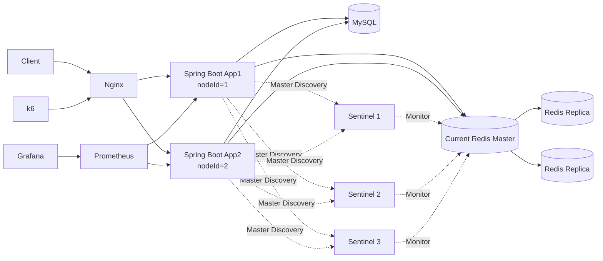
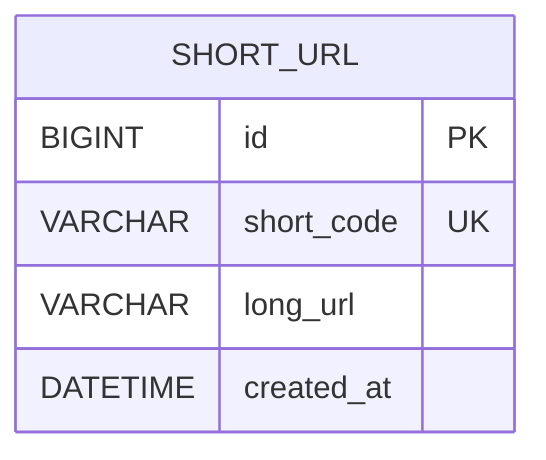

# 03. Architecture

## 1. 설계 목표

* 해결하려는 핵심 문제: 긴 URL을 고유한 단축 URL로 변환하고, 단축 URL 요청을 원본 URL로 리다이렉트한다.
* 가장 중요한 비기능 요구사항: 단축 코드 유일성, 읽기 성능, 확장 가능성
* 설계에서 우선한 요소: 단순한 초기 구조와 측정 가능한 베이스라인
* 감수한 트레이드오프: 초기에는 모든 조회 요청이 MySQL에 집중된다.
* 초기 코드 생성 전략: Sequence ID + Base62
* 최종 코드 생성 전략: 단일 인스턴스에서는 Sequence + Base62를 기본으로 사용하고, 다중 인스턴스에서는 서로 다른 nodeId를 할당한 Snowflake + Base62의 유일성을 검증했다.
* 장애 대응 전략: 애플리케이션 계층은 Nginx 기반 Failover, Redis 계층은 Circuit Breaker·MySQL Fallback과 Sentinel 기반 자동 Failover를 적용한다.

## 2. 전체 아키텍처



Nginx가 클라이언트 요청을 두 개의 Spring Boot 인스턴스로 분산한다.

두 애플리케이션은 상태를 저장하지 않으며 동일한 MySQL을 사용한다.
MySQL은 원본 데이터를 보관하는 Source of Truth이다.

Redis는 리다이렉트 조회 성능을 위한 보조 저장소이며,
Master 1개와 Replica 2개를 3개의 Sentinel이 감시한다.

애플리케이션은 Sentinel을 통해 현재 Redis Master를 탐색하고,
실제 캐시 요청은 현재 Master에 전달한다.

Redis Master 장애 시 Sentinel이 Replica 하나를 새로운 Master로 승격한다.
Failover가 진행되는 동안 발생하는 Redis 요청 실패는
Circuit Breaker와 MySQL Fallback을 통해 처리한다.

리다이렉트 GET 요청에서 특정 애플리케이션 연결에 실패하면
Nginx가 다른 인스턴스로 요청을 재시도한다.

POST 생성 요청은 처리 성공 여부가 불분명한 상태에서 재시도할 경우
중복 생성 가능성이 있으므로 자동 재시도 대상으로 두지 않는다.

다중 애플리케이션 Failover와 Redis Sentinel Failover는
각각 별도의 로컬 Docker 환경에서 검증했다.

## 3. 주요 컴포넌트

| 컴포넌트       | 역할                | 확장 방법                           | 장애 영향       |
| ---------- | ----------------- | ------------------------------- | ----------- |
| Nginx | 요청 분산 및 App 장애 시 Failover | Load Balancer 이중화 | 장애 시 외부 요청 진입 불가 |
| API Server | URL 생성, 검증, 리다이렉트 | App1·App2 무상태 수평 확장 | 단일 App 장애 시 다른 인스턴스가 처리 |
| MySQL      | 원본 URL 영구 저장      | Replica, Partitioning, Sharding | 생성 및 조회 불가  |
| Prometheus | 애플리케이션 지표 수집      | 현재는 단일 인스턴스                     | 성능 지표 수집 불가 |
| Grafana    | 성능 지표 시각화         | 현재는 단일 인스턴스                     | 대시보드 조회 불가  |
| k6         | 부하 테스트 실행         | VU 단계적 증가                       | 서비스에는 영향 없음 |
| Redis | 원본 URL 조회 캐시 | Sentinel 기반 Master·Replica Failover, 필요 시 Cluster 검토 | Master 장애 시 Sentinel 자동 Failover, 전환 중 MySQL Fallback |
| Redis Sentinel | Redis Master 감시 및 자동 Failover | Sentinel 3개, quorum 2 | Sentinel 과반수 상실 시 자동 Failover 제한 |
## 4. 요청 흐름

### URL 생성

1. 클라이언트가 긴 URL을 전달한다.
2. API 서버가 URL 형식과 프로토콜을 검증한다.
3. MySQL에 원본 URL을 저장한다.
4. MySQL에서 생성된 ID를 Base62로 변환한다.
5. 단축 URL을 반환한다.

### URL 리다이렉트

1. 애플리케이션은 Sentinel을 통해 현재 Redis Master를 탐색한다.
2. Circuit Breaker가 CLOSED이면 `shortCode`로 Redis를 조회한다.
3. Cache Hit이면 원본 URL을 반환한다.
4. Cache Miss이면 MySQL의 `short_code` 인덱스로 조회하고 Redis에 저장한다.
5. Redis 조회에 실패하면 MySQL로 Fallback한다.
6. Redis 실패가 반복돼 Circuit Breaker가 OPEN되면 Redis 호출을 생략하고 바로 MySQL을 조회한다.
7. Redis Master 장애 시 Sentinel이 Replica 하나를 새로운 Master로 승격한다.
8. Lettuce가 Sentinel을 통해 변경된 Master를 탐색한다.
9. Redis 호출 성공이 확인되면 Circuit Breaker가 CLOSED로 돌아가 Cache Aside 경로를 다시 사용한다.
10. 원본 URL을 `302 Found`로 반환한다.

### 실패 흐름

1. URL 형식이 잘못된 경우 `400 Bad Request`를 반환한다.
2. 단축 코드 형식이 잘못됐거나 데이터를 찾을 수 없으면 `404 Not Found`를 반환한다.
3. DB 연결에 실패하면 `503 Service Unavailable`을 반환한다. 
4. Redis 연결에 실패하면 MySQL 조회로 전환한다.

## 5. 데이터 모델

### 주요 엔티티

| 엔티티 | 주요 필드 | 설명 |
|---|---|---|
| ShortUrl | id, shortCode, longUrl, createdAt | 단축 코드와 원본 URL을 저장한다. |

### 관계

현재는 단일 엔티티만 사용한다.



모든 생성 전략이 동일한 조회 경로를 사용하도록 `short_code`에 Unique Index를 적용했다.
Base62의 대소문자를 구분하기 위해 `ascii_bin` Collation을 사용한다.

Hash와 난수 Base62 방식에서는 생성된 코드를 저장해야 하므로 이후 `short_code` 컬럼과 Unique Index를 사용하는 별도 구조를 적용한다.

## 6. API 설계

| Method | Endpoint       | 설명                | 멱등성 |
| ------ | -------------- | ----------------- | --- |
| POST | `/api/v1/data/shorten` | 긴 URL을 단축 URL로 변환 | 전략에 따라 다름 |
| GET | `/api/v1/{shortCode}` | 원본 URL로 리다이렉트 | Yes |

동일한 원본 URL을 여러 번 요청하면 서로 다른 단축 URL이 생성될 수 있다.

## 7. 핵심 설계 결정

### 결정 1. 초기 구조에서 MySQL만 사용

#### 문제

읽기 요청이 많은 시스템이므로 캐시가 필요할 것으로 예상된다. 하지만 캐시를 처음부터 적용하면 개선 효과를 비교할 기준이 없다.

#### 선택

초기 구조는 Spring Boot와 MySQL만 사용한다.

#### 이유

DB Only 구조의 RPS, 응답 시간, DB 조회 수와 Connection Pool 사용량을 먼저 측정하기 위해서다.

#### 대안

Redis Cache-Aside를 처음부터 적용할 수 있다.

#### 트레이드오프

구조는 단순하고 베이스라인을 측정할 수 있지만, 모든 리다이렉트 요청이 MySQL에 집중된다.

### 결정 2. 초기 베이스라인으로 순차 ID 기반 Base62 사용

#### 문제

단축 코드는 짧고 중복되지 않아야 한다.

#### 선택

MySQL의 Auto Increment ID를 Base62로 변환한다.

#### 이유

충돌 확인 없이 코드를 생성할 수 있고, Base62 코드를 다시 ID로 변환해 Primary Key로 조회할 수 있다.

#### 대안

Hash 후 충돌 해소와 난수 Base62 방식을 이후 실험에서 비교한다.

#### 트레이드오프

코드 생성은 단순하고 빠르지만 다음 단축 코드를 예측하기 쉽다.

이 선택은 최종 코드 생성 전략을 의미하지 않는다. 다른 생성 방식과 동일한 조건으로 비교한 뒤 최종 전략을 결정한다.

또한 여러 DB가 독립적으로 ID를 발급하는 분산 환경에서는 ID 충돌과 Shard Routing 문제가 발생하므로, 전역 ID 생성기나 다른 코드 생성 전략이 필요하다.

### 결정 3. 302 Redirect 사용

#### 문제

영구 Redirect인 301과 임시 Redirect인 302 중 하나를 선택해야 한다.

#### 선택

초기 구현에서는 `302 Found`를 사용한다.

#### 이유

클라이언트 캐시의 영향을 줄이고 모든 요청이 서버를 통과하도록 해 부하 테스트가 쉽다.

#### 대안

301 Redirect를 별도 실험에서 비교한다.

#### 트레이드오프

Redirect 요청이 계속 서버에 전달되므로 301보다 서버 부하가 커질 수 있다.

## 8. 코드 생성 전략 비교

이번 프로젝트에서는 다음 세 가지 방식을 비교한다.

| 전략              | 생성 방식                          | 주요 확인 항목              |
| --------------- | ------------------------------ | --------------------- |
| Sequence + Base62 | INSERT → ID 발급 → UPDATE | 단순하고 충돌 없음 |
| Hash + Base62 | 중복 조회 → SHA-256 → INSERT | 고정 길이, 충돌 재시도 필요 |
| Snowflake + Base62 | 분산 ID 생성 → INSERT | DB ID 비의존, nodeId 관리 필요 |

초기 구현은 Sequence Base62로 진행하고, 이후 세 방식의 RPS, p95, DB 조회 수와 충돌 횟수를 비교한다.

### 다중 인스턴스에서의 Snowflake

다중 인스턴스 환경에서는 각 애플리케이션에 서로 다른 nodeId를 할당했다.

- App1: nodeId=1
- App2: nodeId=2

애플리케이션 내부에서는 `synchronized`로 timestamp와 sequence 갱신을 보호하고,
서버 간 ID 충돌은 서로 다른 nodeId를 통해 방지한다.

부하 테스트 중 Docker 환경에서 시스템 시간이 4~8ms 역행하는
Clock Rollback을 확인했다.

이전 timestamp로 ID를 생성하지 않고,
작은 시간 역행에서는 마지막 생성 시각까지 시계가 복구되기를 제한된 시간 동안 기다린다.
허용 범위를 초과하는 시간 역행은 ID 중복 위험을 막기 위해 실패 처리한다.

## 9. 데이터 정합성

* 트랜잭션 범위: 원본 URL을 MySQL에 저장하는 단일 트랜잭션
* 동시성 제어: MySQL Auto Increment로 ID 유일성을 보장한다.
* 중복 요청 처리: 동일한 원본 URL의 중복 생성을 허용한다.
* 저장 실패 처리: DB 저장에 실패하면 단축 URL을 반환하지 않는다.
* DB와 캐시 간 정합성: MySQL을 Source of Truth로 두고 Redis에는 조회 결과만 캐시한다.
* Cache Miss 시 MySQL을 조회한 뒤 Redis에 저장한다.
* Redis 저장 실패는 원본 데이터 정합성에 영향을 주지 않으며 DB 조회 결과를 그대로 반환한다.
* Redis Master 장애 시 Sentinel이 Replica를 승격하며, Failover 공백 구간에는 MySQL Fallback으로 조회 기능을 유지한다.
Hash와 난수 방식에서는 `short_code`에 Unique Constraint를 적용해 코드 중복을 방지한다.

## 10. 장애 대응

| 장애 상황 | 영향 | 감지 방법 | 대응 방법 |
|---|---|---|---|
| 단일 API 서버 장애 | 해당 인스턴스 처리 중단 | Health Check, Prometheus `up` | Nginx가 다른 App 인스턴스로 요청 전환 |
| DB 장애 | URL 생성 및 조회 불가 | Connection 오류, Actuator | 503 반환, DB 복구 |
| Redis 요청 실패 | 응답 지연 및 DB 부하 증가 | Cache Error, Fallback 지표 | Circuit Breaker OPEN 후 MySQL Fallback |
| Redis Master 장애 | Cache 사용 불가 및 Failover 공백 발생 | Sentinel, Redis 연결 오류 | Replica 자동 승격 후 새 Master로 재연결 |
| Prometheus 장애 | 지표 수집 불가 | Scrape 상태 | 컨테이너 재시작 |
| Grafana 장애 | 대시보드 조회 불가 | 컨테이너 상태 | 컨테이너 재시작 |

초기 구조에서는 DB 장애 시 요청을 처리할 대체 저장소가 없다.

Redis GET에 실패하면 MySQL로 Fallback한다.

Redis 장애가 확인된 요청에서는 Redis SET을 생략해
한 요청에서 Redis Timeout이 중복되지 않도록 한다.

Redis 실패가 반복돼 Circuit Breaker의 실패율 임계값을 초과하면
Circuit이 OPEN 상태로 전환된다.

OPEN 상태에서는 Redis GET 자체를 호출하지 않고
즉시 MySQL로 Fallback한다.

Redis 계층은 Master 1개, Replica 2개와 Sentinel 3개로 구성했다.

Master 장애 시 Sentinel quorum을 통해 Replica 하나를 새로운 Master로 승격하고,
애플리케이션의 Lettuce 클라이언트가 변경된 Master를 다시 탐색한다.

100 VU 환경에서 현재 Redis Master를 강제로 중단한 결과,
Sentinel은 8.567초 후 `redis-replica-2`를 새로운 Master로 승격했다.

Failover가 진행되는 동안 Circuit Breaker와 MySQL Fallback이 요청을 처리해
총 938,870건의 리다이렉트 요청에서 실패율 0%를 유지했다.

Failover 이후 Cache Hit이 다시 증가하면서
Redis 조회 경로가 자동으로 복구되는 것을 확인했다.

Circuit Breaker와 Fallback은 Failover 공백 구간에서 사용자 요청을 보호하고,
Sentinel은 Redis 계층 자체를 자동 복구하는 역할을 담당한다.

App1 장애 시 Nginx가 App2를 통해 GET 리다이렉트 요청을 계속 처리한다.

Failover 실험에서 App1을 강제로 중단했지만
리다이렉트 요청 실패율 0%를 유지했고,
App1 복구 후 다시 요청 처리에 참여하는 것을 확인했다.

## 11. 단일 장애 지점

* Spring Boot는 App1과 App2로 구성해 단일 애플리케이션 장애 지점을 개선했다.
* Redis는 Master 1개와 Replica 2개를 구성하고 Sentinel 3개를 통해 단일 Redis 노드 장애에 대한 자동 Failover를 검증했다.
* Nginx는 현재 단일 인스턴스이므로 외부 요청 진입 지점의 SPOF로 남아 있다.
* MySQL은 단일 인스턴스로 구성되어 있어 장애 시 URL 생성 및 조회가 불가능하다.
* Prometheus와 Grafana도 단일 인스턴스지만 서비스 요청 처리에는 직접적인 영향을 주지 않는다.

Redis 노드와 Sentinel은 모두 동일한 Docker Desktop 호스트에서 실행했기 때문에,
호스트 자체가 장애 나는 경우 전체 Redis 계층이 함께 영향을 받는다.

따라서 이번 실험은 Redis 프로세스 또는 컨테이너 단위 Failover를 검증한 것이며,
독립적인 Failure Domain에 배치된 실제 운영 환경 수준의 고가용성을 의미하지 않는다.

운영 환경에서는 Load Balancer 이중화와 MySQL Replica 및 장애 조치를 추가로 고려할 수 있다.

Redis 저장 용량 또는 처리량이 단일 노드의 한계를 초과할 경우에는
고가용성과 별도로 Redis Cluster 기반 Sharding을 검토할 수 있다.

## 12. 확장 전략

### 애플리케이션 확장

* Nginx 뒤에 두 개의 Spring Boot 인스턴스를 배치했다.
* 애플리케이션 서버에는 세션이나 URL 상태를 저장하지 않는다.
* App1과 App2는 동일한 MySQL과 Redis를 사용한다.
* Snowflake 사용 시 각 인스턴스에 서로 다른 nodeId를 할당한다.
* 단일 App 장애 시 Nginx를 통해 다른 인스턴스로 GET 요청을 전환한다.

### 데이터베이스 확장

* 초기 조회는 Primary Key 또는 `short_code` Unique Index를 사용한다.
* 읽기 요청이 증가하면 Read Replica를 검토한다.
* 데이터가 단일 DB 용량을 초과하면 Partitioning과 Sharding을 검토한다.

### 캐시 확장

DB Only 부하 테스트에서 반복적인 MySQL 조회가 병목으로 확인돼
Redis Cache-Aside를 적용했다.

```text
Client
→ Spring Boot
→ Redis
→ Cache Miss 시 MySQL
```

- 전략: Redis Cache Aside
- 키: ```short-url:{shortCode}```
- TTL: 1시간
- Redis 요청 실패: Circuit Breaker + MySQL Fallback
- Redis Master 장애: Sentinel 기반 Replica 자동 승격
- Source of Truth: MySQL
- 한계: Failover 공백 구간의 DB 부하 증가와 동일 호스트 Failure Domain

현재 문제는 Redis 저장 용량 부족이 아니라 단일 Master 장애였기 때문에
Redis Cluster는 적용하지 않았다.

향후 Redis 단일 노드의 저장 용량 또는 처리량이 병목으로 확인되면
Cluster 기반 Sharding을 검토한다.

## 13. 보안

* 인증 및 인가: 구현하지 않는다.
* 입력값 검증: `http`, `https` 프로토콜만 허용한다.
* 제한할 프로토콜: `javascript`, `file`, `data`
* 민감정보 저장: 별도의 개인정보를 저장하지 않는다.
* 로그 마스킹: 원본 URL의 Query Parameter 전체를 로그에 남기지 않는다.
* 접근 제한 대상: Actuator와 Prometheus 엔드포인트

순차 ID 기반 코드의 예측 가능성은 코드 생성 전략 비교에서 분석한다.

## 14. 관측 가능성

### Metrics

* RPS
* p50, p95, p99
* HTTP 오류율
* CPU 사용량
* JVM Heap 사용량
* JVM Thread 수
* DB 조회 수
* DB Query Latency
* HikariCP Active Connection
* HikariCP Pending Connection
* 코드 충돌 횟수
* 코드 생성 재시도 횟수
* Redis Cache Error 수
* MySQL Fallback 수
* Redis Circuit Breaker Rejected 수
* Redis Master Failover 소요 시간

### Logs

* 요청 식별자: 필요 시 Request ID를 생성한다.
* 주요 이벤트: URL 생성 실패, 조회 실패, DB 오류
* 오류 로그: 예외 종류와 요청 경로
* 민감정보 제외 기준: 원본 URL과 Query Parameter 전체를 기록하지 않는다.
* Sentinel Master 전환 이벤트와 Failover 시작·완료 시각

### Alerts

로컬 실험에서는 실제 알림 시스템을 구현하지 않는다.

알림 조건 후보는 다음과 같다.

* HTTP 오류율 1% 초과
* p95 목표값 초과
* HikariCP Pending Connection 발생
* MySQL 연결 실패
* Prometheus Target Down
