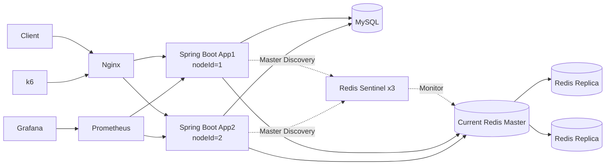
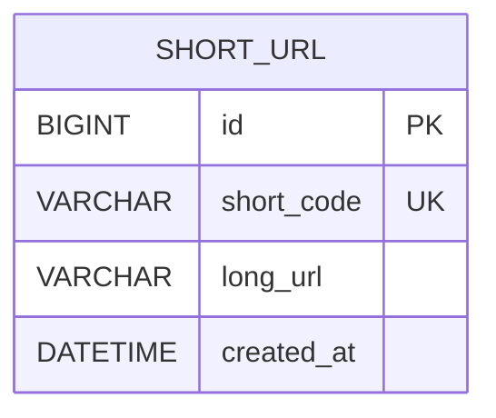

# 03. Architecture

## 1. 설계 목표

* 핵심 기능: 긴 URL을 고유한 단축 코드로 변환하고 원본 URL로 리다이렉트한다.
* 우선순위: 단축 코드 유일성, 읽기 성능, 장애 대응, 수평 확장
* 접근 방식: 단순한 Baseline부터 시작해 부하와 장애를 직접 주입하며 구조를 확장한다.
* 초기 생성 전략: Sequence ID + Base62
* 다중 인스턴스 생성 전략: 서로 다른 nodeId를 사용한 Snowflake + Base62
* 장애 대응: Nginx app Failover, Redis Fallback, Circuit Breaker, Sentinel 자동 Failover

## 2. 전체 아키텍처



MySQL은 원본 데이터를 보관하는 Source of Truth이고 Redis는 조회 캐시다.

App은 무상태로 구성하고 Nginx가 두 인스턴스에 요청을 분산한다. Redis는 Master 1개, Replica 2개를 Sentinel 3개가 감시한다.

Redis Master 장애 시 Sentinel이 Replica를 승격한다. 그 사이 Redis 요청 실패는 Circuit Breaker와 MySQL Fallback으로 처리한다.

GET 요청은 App 연결 실패 시 다른 인스턴스로 재시도한다. POST 생성 요청은 처리 성공 여부가 애매한 상태에서 재시도하면 중복 생성 가능성이 있어 자동 재시도하지 않는다.

다중 App Failover와 Redis Sentinel Failover는 각각 별도 Docker 환경에서 검증했다.

## 3. 주요 컴포넌트

| 컴포넌트       | 역할                     | 확장 방법                           | 장애 영향                   |
| ---------- |------------------------|---------------------------------|-------------------------|
| Nginx | 요청 분산, App Failover    | Load Balancer 이중화               | 장애 시 외부 요청 진입 불가        |
| API Server | URL 생성, 검증, 리다이렉트      | 무상태 수평 확장                       | 단일 App 장애 시 다른 App이 처리  |
| MySQL      | 원본 URL 영구 저장           | Replica, Partitioning, Sharding | 장애 시 생성과 조회 불가          |
| Redis | 원본 URL 조회 캐시           | Sentinel, 필요 시 Cluster          | 장애 전환 중 MySQL Fallback  |
| Redis Sentinel | Master 감시와 자동 Failover | Sentinel 3개, quorum 2           | 과반수 상실 시 자동 Failover 제한 |
| Prometheus | 애플리케이션 지표 수집           | 현재 단일 인스턴스                      | 지표 수집 불가                |
| Grafana    | 지표 시각화                 | 현재 단일 인스턴스                      | 대시보드 조회 불가              |
| k6         | 부하와 장애 실험              | VU 조절                           | 서비스에는 직접 영향 없음          |

## 4. 요청 흐름

### URL 생성

1. 긴 URL을 전달받는다.
2. URL 형식과 프로토콜을 검증한다.
3. 선택된 전략으로 단축 코드를 생성한다.
4. MySQL에 원본 URL과 단축 코드를 저장한다.
5. 단축 URL을 반환한다.

### URL 리다이렉트

1. Sentinel을 통해 현재 Redis Master를 사용한다.
2. Circuit Breaker가 CLOSED이면 Redis를 조회한다.
3. Cache Hit이면 원본 URL을 바로 반환한다.
4. Cache Miss이면 MySQL을 조회하고 Redis에 저장한다.
5. Redis 조회 실패 시 MySQL로 Fallback한다.
6. 장애가 반복되면 Circuit Breaker가 OPEN되어 Redis 호출을 생략한다.
7. Redis Master 장애 시 Sentinel이 Replica를 승격한다.
8. Lettuce가 새 Master를 탐색하고 Redis가 정상화되면 Circuit Breaker가 CLOSED로 돌아간다.
10. 원본 URL을 `302 Found`로 반환한다.

### 실패 흐름

1. 잘못된 URL은 `400 Bad Request`를 반환한다.
2. 존재하지 않는 단축 코드는 `404 Not Found`를 반환한다.
3. DB 연결 실패는 `503 Service Unavailable`을 반환한다. 
4. Redis 연결 실패는 MySQL 조회로 전환한다.

## 5. 데이터 모델

### 주요 엔티티

| 엔티티 | 주요 필드 | 설명 |
|---|---|---|
| ShortUrl | id, shortCode, longUrl, createdAt | 단축 코드와 원본 URL 저장 |

### 관계

현재는 단일 엔티티만 사용한다.



`short_code`에는 Unique Index를 적용했다. Base62의 대소문자를 구분하기 위해 `ascii_bin` Collation을 사용한다.

## 6. API 설계

| Method | Endpoint       | 설명                | 멱등성 |
| ------ | -------------- | ----------------- | --- |
| POST | `/api/v1/data/shorten` | 긴 URL을 단축 URL로 변환 | 전략에 따라 다름 |
| GET | `/api/v1/{shortCode}` | 원본 URL로 리다이렉트 | Yes |

동일한 원본 URL을 여러 번 요청하면 서로 다른 단축 URL이 생성될 수 있다.

## 7. 핵심 설계 결정

### 결정 1. 초기 구조에서 MySQL만 사용

#### 문제

읽기 요청이 많아 Redis가 필요할 것으로 예상됐지만, 처음부터 캐시를 넣으면 개선 효과를 비교할 Baseline이 없다.

#### 선택

초기 구조는 Spring Boot와 MySQL만 사용한다.

#### 이유

DB 조회량, HikariCP Active와 Pending, RPS와 p95를 먼저 측정하기 위해서다.

#### 대안

Redis Cache Aside를 처음부터 적용할 수 있다.

#### 트레이드오프

구조는 단순하지만 모든 리다이렉트 요청이 MySQL에 집중된다.

### 결정 2. 초기 베이스라인으로 순차 ID 기반 Base62 사용

#### 문제

단축 코드는 짧고 중복되지 않아야 한다.

#### 선택

MySQL의 Auto Increment ID를 Base62로 변환한다.

#### 이유

충돌 확인 없이 코드를 생성할 수 있고 구현이 단순한다.

#### 대안

Hash와 Snowflake 방식을 같은 조건에서 비교했다.

#### 트레이드오프

코드는 예측 가능하고 DB ID에 의존한다. 다중 인스턴스에서는 Snowflake처럼 서버별로 ID 공간을 분리하는 방식이 더 적합하다.

### 결정 3. 302 Redirect 사용

#### 문제

영구 Redirect인 301과 임시 Redirect인 302 중 하나를 선택해야 한다.

#### 선택

`302 Found`를 사용한다.

#### 이유

클라이언트 캐시 영향을 줄이고 모든 요청이 서버를 통과하게 해 부하 테스트 결과를 보기 쉽다.

#### 대안

운영 정책에 따라 301을 사용할 수 있다.

#### 트레이드오프

301보다 서버가 더 많은 리다이렉트 요청을 처리한다.

## 8. 코드 생성 전략 비교

이번 프로젝트에서는 다음 세 가지 방식을 비교한다.

| 전략              | 생성 방식                          | 주요 확인 항목             |
| --------------- |--------------------------------| -------------------- |
| Sequence + Base62 | INSERT → ID 발급 → UPDATE        | 단순하고 충돌 없음 |
| Hash + Base62 | 충돌 확인 → Hash(SHA-256) → INSERT | 고정 길이, 재시도 필요 |
| Snowflake + Base62 | 분산 ID 생성 → INSERT              | DB ID 비의존, nodeId 관리 필요 |

### 다중 인스턴스에서의 Snowflake

- App1: nodeId=1
- App2: nodeId=2
- `synchronized`로 timestamp와 sequence 갱신을 보호한다.
- Docker 환경에서 4~8ms Clock Rollback을 관찰했다.
- 작은 시간 역행은 마지막 timestamp까지 제한적으로 기다리고, 허용 범위를 넘으면 실패 처리한다.


## 9. 데이터 정합성

* MySQL을 Source of Truth로 사용한다.
* 단축 코드 유일성은 `short_code` Unique Constraint로 보장한다.
* 동일한 원본 URL의 중복 생성은 허용한다.
* DB 저장에 실패하면 단축 URL을 반환하지 않는다.
* Cache Miss는 MySQL 조회 후 Redis에 저장한다.
* Redis SET 실패는 DB 원본 데이터에 영향을 주지 않는다.
* Redis Failover 공백 구간은 MySQL Fallback으로 조회 기능을 유지한다.

## 10. 장애 대응

| 장애 상황           | 영향                           | 감지 방법 | 대응 방법                       |
|-----------------|------------------------------|---|-----------------------------|
| 단일 App 장애       | 해당 인스턴스 처리 중단                | Health Check, Prometheus `up` | Nginx가 다른 App으로 전환          |
| DB 장애           | 생성과 조회 불가                    | Connection 오류 | 503 반환                      |
| Redis 요청 실패     | 지연과 DB 부하 증가                 | Cache Error, Fallback | Circuit Breaker + MySQL Fallback |
| Redis Master 장애 | Cache 사용 공백  | Sentinel, 연결 오류 | Replica 승격 후 새 Master 연결  |
| Prometheus 장애   | 지표 수집 불가                     | Scrape 상태 | 재시작                     |
| Grafana 장애      | 대시보드 조회 불가                   | 컨테이너 상태 | 재시작                     |

### Redis 장애

Redis GET 실패 시 MySQL로 Fallback하고 같은 요청에서는 Redis SET을 생략한다.

장애가 반복되면 Circuit Breaker가 OPEN되어 Redis 호출 자체를 막는다. Fallback만 사용했을 때 장애 구간 p95는 약 200ms였고, 
Circuit Breaker 적용 후 약 20~30ms 수준으로 줄었다.

### Redis Master Failover

Master 1개, Replica 2개, Sentinel 3개를 구성했다.

100 VU 실험에서 현재 Master를 중단하자 Sentinel이 8.567초 뒤 Replica를 새 Master로 승격했다.
938,870건의 리다이렉트 요청은 실패율 0%를 유지했고 Failover 뒤 Cache Hit이 다시 증가했다.

### App Failover

App1중단 시 Nginx가 App2로 GET 요청을 넘겼다. 446,850건의 요청에서 실패율 0%를 유지했고 App1 복구 뒤 다시 요청 처리에 참여했다.

## 11. 단일 장애 지점

* App은 2개로 구성해 단일 App 장애 지점을 줄였다.
* Redis는 Sentinel로 단일 Redis 노드 장애에 대한 자동 Failover를 검증했다.
* Nginx는 단일 인스턴스로 남아 있다.
* MySQL도 단일 인스턴스로 남아 있다.
* Prometheus와 Grafana 장애는 서비스 요청 처리에는 직접 영향을 주지 않는다.

Redis와 Sentinel은 모두 같은 Docker Desktop 호스트에서 실행했다. 컨테이너 단위 Failover는 검증했지만 독립 Failure Domain을 구성한 운영 수준의 HA는 아니다.

## 12. 확장 전략

### 애플리케이션 확장

* Nginx 뒤에 App1과 App2를 배치한다.
* App은 세션이나 URL 상태를 저장하지 않는다.
* Snowflake 사용 시 인스턴스별 nodeId를 분리한다.
* GET은 App 장애 시 다른 인스턴스로 전환한다.

### 데이터베이스 확장

* 조회는 Primary Key 또는 `short_code` Unique Index를 사용한다.
* 읽기 요청이 증가하면 Read Replica를 검토한다.
* 데이터가 단일 DB 용량을 초과하면 Partitioning과 Sharding을 검토한다.

### 캐시 확장

DB Only 실험에서 반복 조회와 커넥션 대기가 병목으로 확인돼
Redis Cache Aside를 적용했다.

```text
Client
→ Spring Boot
→ Redis
→ Cache Miss 시 MySQL
```

- 키: ```short-url:{shortCode}```
- TTL: 1시간
- Redis 요청 실패: Circuit Breaker + MySQL Fallback
- Redis Master 장애: Sentinel 자동 Failover
- Source of Truth: MySQL

현재 확인한 문제는 저장 용량 부족이 아니라 Master 장애였다. Redis 단일 노드의 용량이나 처리량이 병목으로 확인되면 Cluster 기반 Sharding을 검토한다.

## 13. 보안

* 인증 및 인가는 구현하지 않는다.
* `http`, `https` 프로토콜만 허용한다.
* `javascript`, `file`, `data` 프로토콜은 차단한다.
* 원본 URL과 Query Parameter 전체를 로그에 남기지 않는다.
* Actuator와 Prometheus 엔드포인트는 운영 환경에서 접근 제한이 필요하다.

Sequence 기반 코드의 예측 가능성은 트레이드오프로 남는다.

## 14. 관측 가능성

### Metrics

* RPS, p50, p95, p99, HTTP 오류율
* CPU, JVM Heap, JVM Thread
* DB Lookup, Query Latency
* HikariCP Active, Pending
* 코드 충돌, 생성 재시도
* Cache Hit, Cache Miss, Cache Error
* MySQL Fallback
* Circuit Breaker Rejected
* Redis Master Failover 소요 시간

### Logs

* URL 생성 실패, 조회 실패, DB 오류
* Sentinel Master 전환 이벤트와 Failover 시각
* 원본 URL과 Query Parameter는 제외

### Alerts

로컬 실험에서는 실제 알림 시스템을 구현하지 않는다.

후보 조건:

* HTTP 오류율 1% 초과
* p95 목표값 초과
* HikariCP Pending 발생
* MySQL 연결 실패
* Prometheus Target Down
