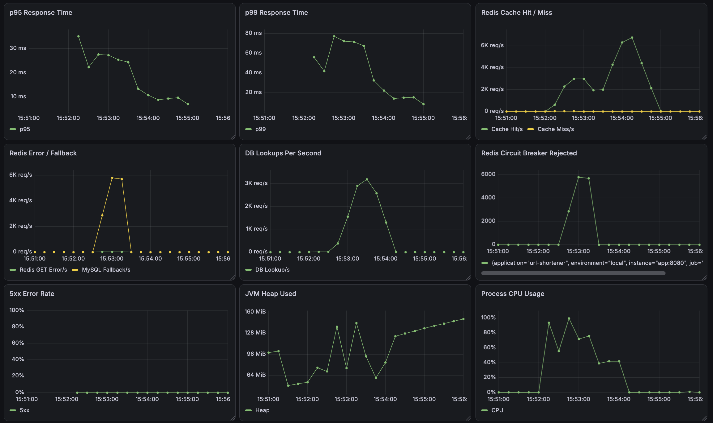
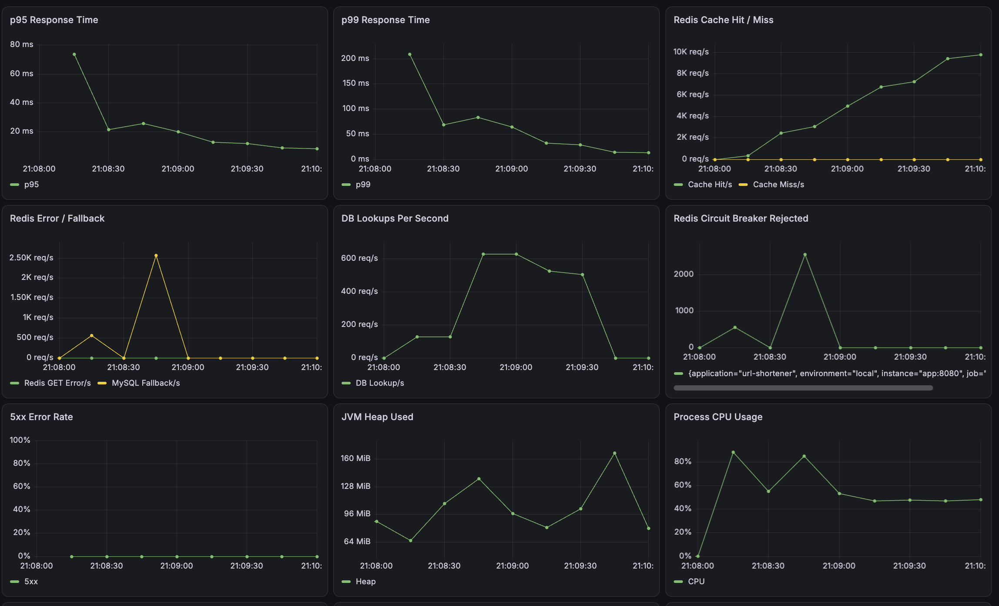

# 04. Experiment

## 1. 실험 목적

MySQL만 사용하는 리다이렉트 구조를 Baseline으로 두고, 부하가 커질 때 어디에서 병목이 생기는지 확인한다.

이후 Redis, Thread 방식, HikariCP, 코드 생성 전략, 다중 App과 Redis 장애 대응을 같은 방식으로 비교한다.

## 2. 가설

> 모든 리다이렉트 요청이 MySQL을 조회하면 VU가 증가할수록 커넥션 대기와 응답 지연이 커질 것이다.

> Redis로 반복 조회를 제거하면 p95와 p99가 낮아지고 처리량이 증가할 것이다.

> 장애 시 Fallback과 Failover를 함께 사용하면 사용자 요청을 유지하면서 복구 시간을 줄일 수 있을 것이다. 

## 3. 비교 대상

| 구분 | Baseline | Experiment |
|---|---|---|
| 구조 | Spring Boot → MySQL | Spring Boot → Redis → MySQL |
| 조회 방식 | 요청마다 DB 조회 | Cache Aside |
| Redirect | 302 | 302 |
| 테스트 VU | 20, 50, 100 | 20, 50, 100 |
| 실행 시간 | 조건별 1분 | 조건별 1분 |

## 4. 통제 변수

### 공통 조건

- 동일한 단축 URL 반복 조회
- Redirect 추적 비활성화
- Think Time 없음
- Java 25
- 조건별 실행 시간 동일

### Redis 비교

- Platform Thread
- HikariCP 최대 10개
- 캐시 활성화 여부만 변경

### Thread 비교

- DB Only
- HikariCP 최대 10개
- Platform Thread와 Virtual Thread만 변경

### HikariCP 비교

- DB Only
- Platform Thread
- 최대 커넥션만 5, 10, 20으로 변경

## 5. 실험 환경

| 항목 | 값                                  |
|---|------------------------------------|
| 실행 환경 | macOS, Docker Desktop              |
| Java | 25                                 |
| Spring Boot | 4.1.0                              |
| Database | MySQL 8.4                          |
| Redis | 7.4                                |
| k6 | 2.1.0                              |
| Prometheus | 3.13.0                             |
| Grafana | 13.1.1                             |

## 6. 부하 테스트 시나리오

### Smoke Test

- VU: 1
- 실행 시간: 10초
- 목적: URL 생성과 리다이렉트 기능 확인

### Load Test

- VU: 20, 50, 100
- 실행 시간: 조건별 1분
- 요청: 동일 shortCode GET Redirect

### Stress Test

- VU: 100 → 200 → 300 → 500
- 전체 실행 시간: 4분 20초
- 비교: DB Only / Redis Cache Aside
- 목적: 처리량 정체와 p95 상승 구간 확인


## 7. 측정 지표

### k6

- 요청 수, RPS
- 평균, p95, p99, 최대 응답 시간
- 실패율, Check 성공률

### 서버 관점

- Process CPU, JVM Heap, Thread
- HikariCP Active, Pending
- DB Lookup
- Cache Hit, Miss, Error
- MySQL Fallback, Circuit Breaker Rejected

Virtual Thread 실험에서는 Mounted, Queued, Carrier Pool, Pinning도 확인했다.

## 8. Warm-up

- DB Only: 별도 Warm-up 없음
- Redis: `setup()`에서 최초 조회로 캐시 저장
- 생성 요청과 Warm-up 요청은 측정 구간에서 제외

## 9. Baseline 결과

### DB Only Redirect

| VU | 실행 시간 | 요청 수 | RPS | 평균 | p95 | p99 | 최대 | 실패율 |
|---:|---:|---:|---:|---:|---:|---:|---:|---:|
| 20 | 1분 | 477,253 | 7,950.61 | 2.38ms | 4.35ms | 6.28ms | 52.12ms | 0.00% |
| 50 | 1분 | 443,039 | 7,379.92 | 6.57ms | 16.17ms | 27.73ms | 305.05ms | 0.00% |
| 100 | 1분 | 512,241 | 8,531.95 | 11.49ms | 32.96ms | 49.88ms | 288.32ms | 0.00% |

### 관찰

- VU가 증가할수록 평균, p95, p99가 증가했다.
- 20 VU 대비 100 VU p95는 약 7.6배 증가했다.
- 이 단계의 k6 결과만으로는 MySQL을 병목으로 단정하지 않고 서버 지표를 추가로 확인했다.

## 10. 개선 내용

리다이렉트 경로에 Redis Cache Aside를 적용했다.

```text
Redis 조회
→ Cache Hit: 원본 URL 반환
→ Cache Miss: MySQL 조회
→ Redis 저장
```

목표는 반복 DB 조회와 HikariCP 대기를 줄이는 것이다.

## 11. 개선 후 결과

### Redis Redirect

|  VU | 요청 수 | RPS | 평균 | p95 | p99 | 최대 | 실패율 |
|----:|---:|---:|---:|---:|---:|---:|---:|
| 20  | 789,780 | 13,155.12 | 1.39ms | 2.81ms | 5.67ms | 198.76ms | 0.00% |
|  50 | 975,688 | 16,238.53 | 2.90ms | 6.10ms | 11.20ms | 192.33ms | 0.00% |
| 100 | 1,043,207 | 17,371.33 | 5.49ms | 11.93ms | 21.52ms | 154.10ms | 0.00% |

### Baseline 비교

| VU | 지표 | Baseline | Redis  | 변화 |
|---:|---|---:|---:|---:|
| 20 | RPS | 7,950.61 | 13,155.12 | 65.46% 증가 |
| 20 | p95 | 4.35ms | 2.81ms | 35.40% 감소 |
| 20 | p99 | 6.28ms | 5.67ms | 9.71% 감소 |
| 50 | RPS | 7,379.92 | 16,238.53 | 120.04% 증가 |
| 50 | p95 | 16.17ms | 6.10ms | 62.28% 감소 |
| 50 | p99 | 27.73ms | 11.20ms | 59.61% 감소 |
| 100 | RPS | 8,531.95 | 17,371.33 | 103.60% 증가 |
| 100 | p95 | 32.96ms | 11.93ms | 63.80% 감소 |
| 100 | p99 | 49.88ms | 21.52ms | 56.86% 감소 |

### 100 VU 서버 지표 비교

| 지표 | DB Only | Redis |
|---|---:|---:|
| DB Lookup | 366,248 | 1 |
| Cache Hit Ratio | 0% | 약 100% |
| Process CPU 최대 | 약 74% | 약 49% |
| JVM Heap 최대 | 약 160MiB | 약 192MiB |
| JVM Live Threads 최대 | 약 121 | 약 125 |
| HikariCP Active 최대 | 약 10 | 관찰되지 않음 |
| HikariCP Pending 최대 | 약 85 | 관찰되지 않음 |
| 5xx 오류율 | 0% | 0% |

DB Only에서는 모든 요청이 MySQL을 조회했고 HikariCP 10개가 모두 사용됐다. Pending은 약 85까지 증가했다.

Redis 적용 뒤 최초 1회를 제외한 요청이 Cache Hit로 처리됐고 DB Lookup과 커넥션 대기가 사실상 사라졌다.

#### Grafana 측정 결과

**DB Only**


**Redis**


## 12. 결과 분석

* 반복 조회의 핵심 병목은 HikariCP 커넥션 대기였다.
* Redis 적용 후 100VU RPS는 약 2배 증가했고 p95는 63.8% 감소했다.
* 캐시는 단순히 응답 시간을 줄인 것이 아니라 DB 조회와 커넥션 풀 사용을 함께 제거했다.

## 13. Platform Thread와 Virtual Thread 비교

DB Only, HikariCP 10, 100 VU, 1분 조건에서 Thread 방식만 변경했다.

| 지표 | Platform Thread | Virtual Thread |
|---|---:|---:|
| 요청 수 | 337,498 | 238,090 |
| RPS | 5,576.15 | 3,942.58 |
| 평균 응답 시간 | 17.56ms | 25.04ms |
| p95 | 50.24ms | 56.39ms |
| p99 | 105.40ms | 152.11ms |
| 최대 응답 시간 | 1.07s | 1.28s |
| Process CPU 최대 | 약 90% | 약 62% |
| Platform Live Threads 최대 | 약 121 | 약 34 |
| HikariCP Active 최대 | 10 | 10 |
| HikariCP Pending 최대 | 약 85 | 약 87 |
| 오류율 | 0% | 0% |

* Virtual Thread는 Platform Thread 수와 CPU를 줄였다.
* 처리량과 응답 시간은 오히려 나빠졌다.
* 두 방식 모두 DB 커넥션을 기다렸기 때문에 Thread 방식보다 HikariCP가 먼저 제한 요소가 됐다.
* 이번 결과만으로 Virtual Thread 자체가 느리다고 일반화하지 않는다.

### Virtual Thread 실행 지표

| 지표 | 결과 |
|---|---:|
| Mounted 관찰 최대 | 약 8 |
| Queued 관찰 최대 | 약 9 |
| Carrier Pool Size 최대 | 8 |
| Target Parallelism | 8 |
| Pinned Events | 0 |
| Submit Failed | 0 |


#### Grafana 측정 결과

**Platform Thread**


**Virtual Thread**


## 14. HikariCP Pool 크기 비교

DB Only, Platform Thread, 100VU에서 최대 커넥션만 변경했다.

| 지표 | Pool 5 | Pool 10 | Pool 20 |
|---|---:|---:|---:|
| 요청 수 | 341,196 | 466,563 | 438,566 |
| RPS | 5,670.37 | 7,753.05 | 7,288.71 |
| 평균 응답 시간 | 17.47ms | 12.66ms | 13.49ms |
| p95 | 51.37ms | 36.01ms | 38.87ms |
| p99 | 99.99ms | 74.36ms | 70.45ms |
| 최대 응답 시간 | 830.87ms | 598.46ms | 335.53ms |
| 오류율 | 0% | 0% | 0% |

* Pool 5는 커넥션 수가 부족했다.
* 단일 실행에서는 Pool 10이 RPS와 일반 응답 지연의 균형이 가장 좋았다.
* Pool 20은 p99와 최댓값은 줄었지만 RPS와 p95가 좋아지지 않았다.
* 커넥션 수를 늘린다고 성능이 계속 좋아지는 것은 아니었다.

## 15. Stress Test

DB Only와 Redis 구조에서 VU를 100, 200, 300, 500까지 올렸다.

### k6 전체 결과

| 지표 | DB Only | Redis |
|---|---:|---:|
| Redirect 요청 수 | 2,123,358 | 4,586,523 |
| 전체 평균 RPS | 8,160.01 | 17,598.13 |
| 평균 응답 시간 | 30.87ms | 13.61ms |
| p90 | 73.64ms | 22.63ms |
| p95 | 90.98ms | 26.75ms |
| 최대 응답 시간 | 389.70ms | 475.44ms |
| 요청 실패율 | 0% | 0% |

### DB Only 관찰

* 약 200 VU 이후 RPS가 8.5K~9K 수준에서 정체됐다.
* HikariCP Active는 10에 도달했고 Pending은 약 180~190까지 증가했다.
* 더 많은 요청이 처리량 증가보다 대기 증가로 이어졌다.

### Redis 관찰

| 지표 | 결과 |
|---|---:|
| Cache Hit | 4,586,523 |
| Cache Miss | 1 |
| DB Lookup | 1 |
| Cache Hit Ratio | 약 100% |

* 처리량은 약 22K RPS 부근까지 증가했다.
* 500 VU까지 요청 실패는 없었다.
* Redis 구조도 처리량 증가가 둔화됐지만 원인은 App, Redis, 네트워크, 로컬 환경 중 하나로 분리하지 않았다.

### 결과 해석

Redis는 반복 DB 조회와 커넥션 대기를 제거해 전체 평균 처리량을 약 2.16배 높이고 p95를 낮췄다.

#### Grafana 측정 결과

**DB Only**


**Redis**


## 16. 단축 코드 생성 전략 비교

Platform Thread, HikariCP 10, 20 VU, 1분 조건에서 신규 URL을 계속 생성했다.

| 지표 | Sequence + Base62 | Hash + Base62 | Snowflake + Base62 |
|---|---:|---:|---:|
| 요청 수 | 97,495 | 77,933 | 99,631 |
| RPS | 1,624.60 | 1,298.60 | 1,660.20 |
| 평균 응답 시간 | 12.12ms | 15.18ms | 11.85ms |
| p95 | 22.23ms | 30.14ms | 21.52ms |
| 최대 응답 시간 | 254.82ms | 467.43ms | 274.23ms |
| 실패율 | 0% | 0% | 0% |

```text
Sequence    : INSERT → Auto Increment ID → Base62 → UPDATE
Hash        : 충돌 확인 SELECT → Hash(SHA-256) → INSERT
Snowflake   : 분산 ID → Base62 → INSERT
```

* Snowflake가 단일 실행에서 가장 높은 RPS와 가장 낮은 p95를 기록했다.
* Sequence도 성능 차이는 작고 구현이 가장 단순했다. 
* Hash는 충돌 확인과 재시도 비용이 추가돼 가장 느렸다.
* 다중 App에서는 DB ID에 의존하지 않는 Snowflake를 검증했고 nodeId를 분리했다.

## 17. Redis 장애 시 MySQL Fallback

Redis GET 실패 시 MySQL로 전환하도록 Fallback을 적용했다.

| 항목 | 조건 |
|---|---|
| VU | 100 |
| 실행 시간 | 120초 |
| 정상 | 0~30초 |
| Redis 중지 | 30~60초 |
| 복구 관찰 | 60~120초 |
| Redis Timeout | 200ms |

### 결과

| 지표 | 결과 |
|---|---:|
| 요청 수 | 656,623 |
| 평균 RPS | 5,471.30 |
| 평균 응답 시간 | 18.09ms |
| 전체 p95 | 31.92ms |
| 최대 응답 시간 | 345.44ms |
| 실패율 | 0% |

* 장애 중 GET Error, Fallback, DB Lookup이 함께 증가했다.
* 장애 구간 p95는 약 200ms, p99는 약 220ms였다.
* Redis 복구 뒤 Cache Hit 경로로 자동 복귀했다.


## 18. 다중 인스턴스 및 Failover

App을 2개로 확장하고 Nginx가 요청을 분산하도록 구성했다.

### Snowflake 다중 인스턴스

| 인스턴스 | nodeId |
|---|---:|
| App1 | 1 |
| App2 | 2 |

동시 생성 테스트에서 shortCode 중복이 발생하지 않았다.

테스트 중 Docker 시스템 시간이 App1 8ms, App2 4ms 역행하는 Clock Rollback도 확인했다. 
작은 역행은 마지막 timestamp까지 기다리고 큰 역행은 실패 처리하도록 했다.

### 애플리케이션 Failover

| 항목 | 조건 |
|---|---|
| VU | 100 |
| 실행 시간 | 120초 |
| 정상 구간 | 0~30초 |
| App1 중지 | 30~60초 |
| App1 재시작 | 60초 |

### 결과

| 지표 | 결과 |
|---|---:|
| 요청 수 | 446,850 |
| 평균 RPS | 3,723.29 |
| 평균 응답 시간 | 26.68ms |
| p95 | 67.40ms |
| 최대 응답 시간 | 2,922.56ms |
| 실패율 | 0% |
| Check 성공률 | 100% |

* App1 중단 뒤 `up=0`이 확인됐다.
* App2가 단독으로 GET 요청을 처리했다.
* 전체 요청 실패율은 0%duTek.
* App1 복구 뒤 다시 요청 처리에 참여했다.

#### Grafana 측정 결과


Nginx와 MySQL은 단일 인스턴스로 남아 있으므로 이 실험은 App 계층 Failover만 검증했다.

## 19. Redis Circuit Breaker

Fallback만 적용했을 때 모든 요청이 Redis Timeout을 기다리는 문제가 남았다. 
Redis GET 경로에 Circuit Breaker를 추가했다.

### 설정

| 항목 | 값 |
|---|---:|
| Sliding Window | 최근 10건 |
| 최소 호출 수 | 5건 |
| 실패율 임계값 | 50% |
| OPEN 유지 시간 | 5초 |
| HALF_OPEN 시험 호출 | 3건 |
| Redis Timeout | 200ms |

### Fallback-only 비교

| 지표 | Fallback only | Circuit Breaker |
|---|---:|---:|
| VU | 100 | 100 |
| Redis 장애 시간 | 30초 | 30초 |
| 장애 구간 p95 | 약 200ms | 약 20~30ms |
| 장애 구간 p99 | 약 220ms | 약 40~80ms |
| 5xx 오류율 | 0% | 0% |
| Redis 호출 | 장애 중 반복 | OPEN 이후 차단 |

* 장애 직후 실제 Redis 실패가 발생한 뒤 Circuit이 OPEN됐다.
* OPEN 상태에서는 Redis를 호출하지 않고 MySQL로 바로 전환됐다.
* Rejected와 Fallback이 증가했지만 5xx는 발생하지 않았다.
* Redis 복구 뒤 Cache Hit이 다시 증가했다.

Fallback은 기능을 유지하고, Circuit Breaker는 반복 Timeout을 줄이는 역할로 나눴따.

#### Grafana 측정 결과



## 20. Redis Sentinel 자동 Failover

Redis 장애를 우회하는 것에서 끝내지 않고 Redis 계층 자체의 자동 복구를 검증했다.

```text
                   Spring Boot
                        |
                  Sentinel x 3
                        |
                 Current Master
                  /     |     \
             Redis   Redis   Redis
```

### 실험 조건

| 항목 | 값 |
|---|---:|
| VU | 100 |
| 실행 시간 | 120초 |
| Master 중단 | 실행 30초 후 |
| 기존 Master 재시작 | 실행 약 60초 후 |
| Redis 노드 | 3개 |
| Sentinel | 3개 |
| Sentinel quorum | 2 |
| down-after-milliseconds | 5초 |

### 결과

| 지표 | 결과 |
|---|---:|
| 기존 Master | redis-replica-1 |
| 새로운 Master | redis-replica-2 |
| Sentinel Failover 시간 | 8.567초 |
| 총 요청 수 | 938,870 |
| 처리량 | 7,823.30 req/s |
| 평균 응답시간 | 12.65ms |
| p95 | 23.72ms |
| 최대 응답시간 | 1.98s |
| 요청 실패율 | 0% |
| Redirect 검증 성공률 | 100% |

* Master 장애 직후 Circuit Breaker와 MySQL Fallback이 요청을 보호했다.
* Sentinel은 8.567초 뒤 Replica를 새 Master로 승격했다.
* Lettuce가 새 Master에 연결된 뒤 Cache Hit 경로가 복구됐다.
* 전체 938,870건의 요청에서 실패가 발생하지 않았다.

#### Grafana 측정 결과



## 21. 실험 한계

### 공통 환경
- 모든 실험은 로컬 Docker Desktop에서 실행했다.
- k6, App, MySQL, Redis가 같은 장비의 CPU와 메모리를 공유했다.
- 조건별 1회 측정이므로 실행 환경의 변동이 포함될 수 있다.
- Prometheus 수집 간격보다 짧은 변화는 그래프에서 누락될 수 있다.

### 성능 실험
- Load Test는 조건별 1분, Stress Test는 구조별 4분 20초 동안 실행했다.
- 하나의 shortCode를 반복 조회해 Hot Key에 가까운 패턴이다.
- 고정 VU 방식은 응답이 빨라질수록 같은 시간에 더 많은 요청이 발생한다.
- Stress Test의 k6 최종 값은 전체 VU 구간을 합산한 값이라 구간별 변화는 Grafana 시계열로 판단했다.
- Redis가 약 22K RPS에서 둔화된 원인을 App, Redis, 네트워크 중 하나로 분리하지 않았다.

### 코드 생성 실험
- Sequence, Hash, Snowflake는 조건별 1회씩 측정했다.
- Sequence와 Snowflake의 작은 차이가 환경 변동인지 성능 차이인지 반복 측정하지 않았다.
- Clock Rollback은 Docker 환경에서 관찰한 4~8ms 수준만 다뤘다.

### 장애와 Failover 실험
- Redis 장애는 프로세스 중지 중심으로 재현했고 네트워크 지연과 패킷 손실은 다루지 않았다.
- Redis 장애 중 부하가 더 커지면 MySQL과 HikariCP가 다시 포화될 수 있다.
- App Failover는 같은 호스트의 App 2개와 Nginx 1개로 검증했다.
- Circuit Breaker 상태는 Rejected 지표로 확인했고 CLOSED, OPEN, HALF_OPEN을 별도 메트릭으로 기록하지 않았다.
- Redis 노드와 Sentinel도 같은 Docker 호스트에 있어 독립 Failure Domain을 구성한 운영 환경과는 차이가 있다.
- Sentinel 실험의 p95는 23.72ms였지만 Failover 순간 최대 1.98초의 tail latency가 발생했다.
- Sentinel은 자동 Failover를 제공하지만 Redis Cluster처럼 데이터 Sharding을 제공하지 않는다.

## 20. 후속 실험

- [x] Redis Cache Aside 적용
- [x] Redis 적용 전후 부하 테스트
- [x] Prometheus와 Grafana 서버 지표 비교
- [x] Platform Thread와 Virtual Thread 비교
- [x] HikariCP Pool 크기 비교
- [x] 500 VU Stress Test
- [x] Sequence, Hash, Snowflake 생성 전략 비교
- [x] Redis 장애 시 MySQL Fallback 검증
- [x] 다중 App과 Nginx Failover 검증
- [x] Circuit Breaker로 Redis 장애 구간 Timeout 감소
- [x] Redis Sentinel 자동 Failover 검증
- [ ] 조건별 반복 측정 후 중앙값 비교
- [ ] Redis 용량 또는 처리량 병목 발생 시 Cluster 기반 Sharding 검토
