# 04. Experiment

## 1. 실험 목적

MySQL만 사용하는 초기 리다이렉트 구조에서 VU 증가에 따라 처리량과 응답 시간이 어떻게 변하는지 확인한다.

측정 결과는 이후 Redis 캐시 적용 전후를 비교하기 위한 Baseline으로 사용한다.

## 2. 가설

> 모든 리다이렉트 요청이 MySQL 조회를 수행하므로 VU가 증가하면 응답 시간이 증가할 것이다.

> Redis 캐시를 적용하면 반복적인 DB 조회가 줄어들어 p95와 p99가 감소하고 처리량이 증가할 것이다.

## 3. 비교 대상

| 구분 | Baseline | Experiment |
|---|---|---|
| 구조 | Spring Boot → MySQL | Spring Boot → Redis → MySQL |
| 조회 방식 | 요청마다 DB 조회 | Cache Aside |
| Redirect | 302 | 302 |
| 테스트 VU | 20, 50, 100 | 20, 50, 100 |
| 실행 시간 | 조건별 1분 | 조건별 1분 |

## 4. 통제 변수

### 공통 조건

- 동일한 단축 URL 1개 반복 조회
- 애플리케이션 인스턴스 1개
- MySQL 인스턴스 1개
- Java 25
- Redirect 추적 비활성화
- Think Time 없음
- 조건별 테스트 시간 1분

### Redis 비교

- Platform Thread 사용
- HikariCP 최대 커넥션 10개
- 캐시 활성화 여부만 변경

### Thread 비교

- DB Only
- HikariCP 최대 커넥션 10개
- Platform Thread와 Virtual Thread만 변경

### HikariCP 비교

- DB Only
- Platform Thread
- HikariCP 최대 커넥션만 5, 10, 20으로 변경

## 5. 실험 환경

| 항목 | 값 |
|---|---|
| 실행 환경 | macOS, Docker Desktop |
| Java | 25 |
| Spring Boot | 4.1.0 |
| Database | MySQL 8.4 |
| Redis |  Baseline 미적용 / Experiment 적용 |
| k6 | 2.1.0 |
| Prometheus | 3.13.0 |
| Grafana | 13.1.1 |
| 서버 지표 | 100 VU 실험에서 Prometheus·Grafana로 기록 |

## 6. 부하 테스트 시나리오

### Smoke Test

- 목적: URL 생성과 리다이렉트 기능 확인
- VU: 1
- 실행 시간: 10초
- 조건:
    - Check 성공률 99% 초과
    - 실패율 1% 미만
    - p95 500ms 미만

### Load Test

- 목적: VU별 처리량과 응답 시간 측정
- VU: 20, 50, 100
- 실행 시간: 조건별 1분
- 요청 대상: 동일한 단축 URL
- Redirect 추적: 비활성화

### Stress Test

- 수행 여부: 완료
- 목적:
  - VU 증가에 따른 처리량 한계 확인
  - p95와 p99가 급격히 증가하는 구간 확인
  - DB Only와 Redis 구조의 한계 비교
- 비교 대상: DB Only / Redis Cache Aside
- 공통 조건:
  - Platform Thread
  - HikariCP 최대 커넥션 10개
  - 동일한 단축 URL 반복 조회
  - Redirect 추적 비활성화
  - Think Time 없음
- 부하 단계: 100 → 200 → 300 → 500 VU
- 전체 실행 시간: 4분 20초

## 7. 측정 지표

### k6

- 요청 수
- RPS
- 평균 응답 시간
- p95
- p99
- 최대 응답 시간
- 실패율
- Check 성공률

### 서버 관점

- Process CPU
- JVM Heap
- Platform Thread 수
- HikariCP Active·Pending
- MySQL 조회량
- Virtual Thread Mounted·Queued
- Carrier Pool Size
- Virtual Thread Pinning·제출 실패

CPU, JVM, HikariCP, DB Lookup 지표는 100 VU 비교 실험에서 기록했다.

### Redis 적용 후 추가 지표

- 캐시 Hit 수
- 캐시 Miss 수
- 캐시 Hit Ratio
- MySQL 조회 횟수 변화

## 8. Warm-up

- DB Only: 별도 Warm-up 없음
- Redis: `setup()`에서 최초 조회로 캐시 저장
- URL 생성과 Redis Warm-up 요청은 측정 구간에서 제외

## 9. Baseline 결과

### DB Only Redirect

- 구조: k6 → Spring Boot → MySQL
- Redirect: 302
- 테스트 대상: 동일한 단축 URL 반복 조회
- 요청 수: `setup()` 요청을 제외한 `iterations`

| VU | 실행 시간 | 요청 수 | RPS | 평균 | p95 | p99 | 최대 | 실패율 |
|---:|---:|---:|---:|---:|---:|---:|---:|---:|
| 20 | 1분 | 477,253 | 7,950.61 | 2.38ms | 4.35ms | 6.28ms | 52.12ms | 0.00% |
| 50 | 1분 | 443,039 | 7,379.92 | 6.57ms | 16.17ms | 27.73ms | 305.05ms | 0.00% |
| 100 | 1분 | 512,241 | 8,531.95 | 11.49ms | 32.96ms | 49.88ms | 288.32ms | 0.00% |

### 관찰

- 모든 조건에서 실패율은 0%, Check 성공률은 100%였다.
- VU가 증가할수록 평균, p95, p99 응답 시간이 증가했다.
- 20 VU 대비 100 VU에서 p95는 약 7.6배 증가했다.
- 100 VU의 처리량은 가장 높았지만 응답 시간 증가 폭도 컸다.
- 50 VU의 RPS가 상대적으로 낮아 단일 실행 결과의 변동성이 확인됐다.
- 서버와 DB 지표를 측정하지 않았으므로 현재 결과만으로 MySQL을 병목으로 단정할 수는 없다.

## 10. 개선 내용

리다이렉트 조회에 Redis Cache Aside 전략을 적용했다.

```text
Redis 조회
→ Cache Hit: 원본 URL 반환
→ Cache Miss: MySQL 조회
→ Redis 저장
→ 원본 URL 반환
```

기대 효과:

- 반복 DB 조회 감소
- p95와 p99 감소
- 처리량 증가
- HikariCP 사용량 감소

## 11. 개선 후 결과

### Redis Redirect

| VU | 실행 시간 | 요청 수 | RPS | 평균 | p95 | p99 | 최대 | 실패율 |
|---:|---:|---:|---:|---:|---:|---:|---:|---:|
| 20 | 1분 | 789,780 | 13,155.12 | 1.39ms | 2.81ms | 5.67ms | 198.76ms | 0.00% |
| 50 | 1분 | 975,688 | 16,238.53 | 2.90ms | 6.10ms | 11.20ms | 192.33ms | 0.00% |
| 100 | 1분 | 1,043,207 | 17,371.33 | 5.49ms | 11.93ms | 21.52ms | 154.10ms | 0.00% |

### Baseline 비교

| VU | 지표 | Baseline | Redis 적용 | 변화 |
|---:|---|---:|---:|---:|
| 20 | RPS | 7,950.61 | 13,155.12 | 65.46% 증가 |
| 20 | p95 | 4.35ms | 2.81ms | 35.40% 감소 |
| 20 | p99 | 6.28ms | 5.67ms | 9.71% 감소 |
| 50 | RPS | 7,379.92 | 16,238.53 | 120.04% 증가 |
| 50 | p95 | 16.17ms | 6.10ms | 62.28% 감소 |
| 50 | p99 | 27.73ms | 11.20ms | 59.61% 감소 |
| 100 | RPS | 8,531.95 | 17,371.33 | 103.60% 증가 |
| 100 | p95 | 32.96ms | 11.93ms | 63.80% 감소 |
| 100 | p99 | 49.88ms | 21.52ms | 56.86% 감소 |

### 100 VU 서버 지표 비교

캐시 활성화 여부만 변경한 동일한 코드에서 100 VU로 1분간 측정했다.

| 지표 | DB Only | Redis |
|---|---:|---:|
| DB Lookup | 366,248 | 1 |
| Cache Hit Ratio | 0% | 약 100% |
| Process CPU 최대 | 약 74% | 약 49% |
| JVM Heap 최대 | 약 160MiB | 약 192MiB |
| JVM Live Threads 최대 | 약 121 | 약 125 |
| HikariCP Active 최대 | 약 10 | 관찰되지 않음 |
| HikariCP Pending 최대 | 약 85 | 관찰되지 않음 |
| 5xx 오류율 | 0% | 0% |

DB Only에서는 k6 iterations와 DB Lookup이 모두 366,248건으로 일치했다.
모든 리다이렉트 요청이 MySQL을 조회한 것이다.

HikariCP Active는 기본 최대 연결 수인 10개에 도달했고,
Pending 요청도 약 85개까지 증가했다.
DB 커넥션 대기가 p95와 p99 증가의 주요 원인으로 나타났다.

Redis 적용 후에는 최초 요청에서만 DB를 조회했고,
이후 요청은 Cache Hit로 처리됐다.
Prometheus 수집 시점에서는 HikariCP 연결 사용과 대기가 관찰되지 않았다.

> HikariCP는 애플리케이션이 MySQL 연결을 미리 생성하고 빌려 쓰도록 관리하는 커넥션 풀이다.

#### Grafana 측정 결과

**DB Only**

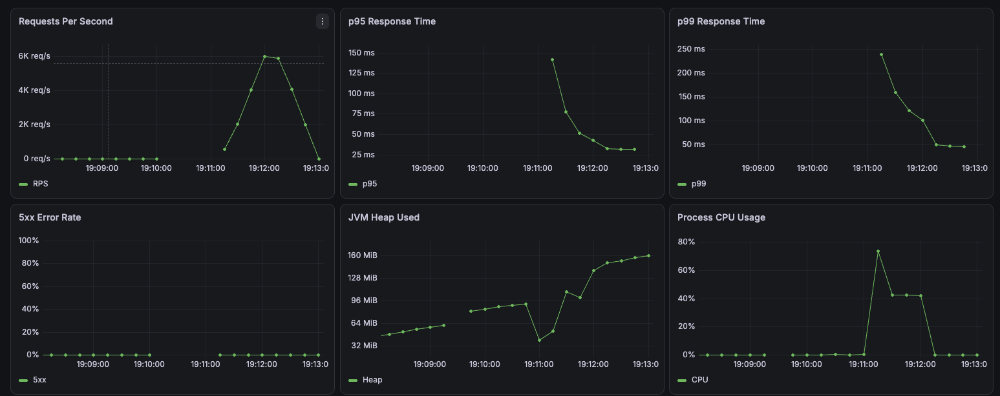

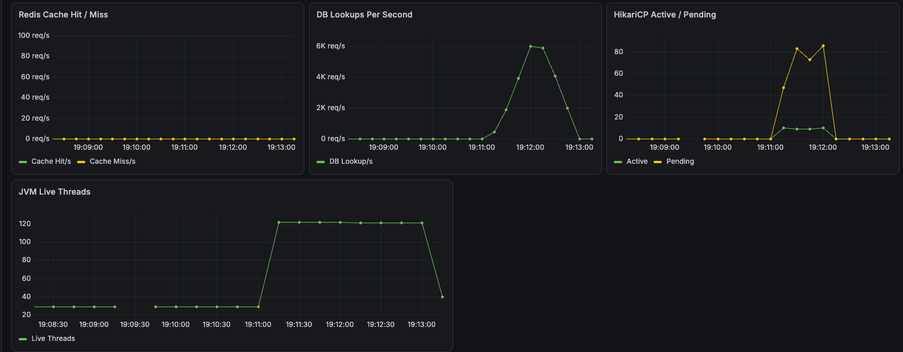

**Redis**

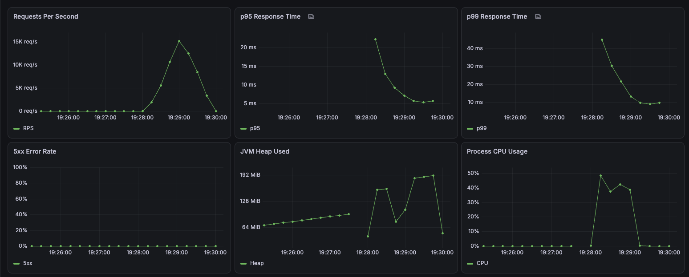

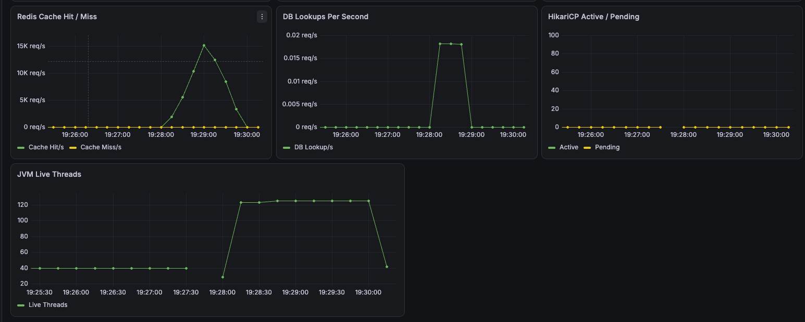

## 12. 결과 분석

Redis 적용 후 모든 VU 구간에서 실패율 0%를 유지하면서 처리량이 증가하고 p95와 p99가 감소했다.

100 VU 서버 지표에서 DB Only는 모든 요청마다 MySQL을 조회했다.
HikariCP의 10개 커넥션이 모두 사용됐고 최대 약 85개의 요청이 커넥션을 기다렸다.

Redis 적용 후에는 최초 1회를 제외한 요청이 Cache Hit로 처리됐다.   
반복적인 DB 조회가 사실상 제거됐으며,
Prometheus 수집 시점에서는 HikariCP 연결 사용과 대기가 관찰되지 않았다.
이에 따라 응답 지연이 감소하고 처리량이 증가했다.

따라서 반복 조회가 많은 리다이렉트 경로에서는 Redis Cache Aside가 DB 접근과 커넥션 풀 병목을 줄이는 데 효과적이었다.

## 13. Platform Thread와 Virtual Thread 비교

DB Only, HikariCP 최대 커넥션 10개, 100 VU, 1분 조건에서
스레드 방식만 변경해 비교했다.

| 지표 | Platform Thread | Virtual Thread |
|---|---:|---:|
| 요청 수 | 337,498 | 238,090 |
| RPS | 5,576.15 | 3,942.58 |
| 평균 응답 시간 | 17.56ms | 25.04ms |
| p95 | 50.24ms | 56.39ms |
| p99 | 105.40ms | 152.11ms |
| 최대 응답 시간 | 1.07s | 1.28s |
| Process CPU 최대 | 약 90% | 약 62% |
| Platform Live Threads 최대 | 약 121 | 약 34 |
| HikariCP Active 최대 | 10 | 10 |
| HikariCP Pending 최대 | 약 85 | 약 87 |
| 오류율 | 0% | 0% |

Virtual Thread 적용 후 Platform Thread 수와 Process CPU 사용량은 감소했다.

하지만 RPS는 감소했고 평균, p95, p99 응답 시간은 증가했다.
두 방식 모두 HikariCP 최대 커넥션 10개를 사용했으며,
약 80개 이상의 요청이 DB 커넥션을 기다렸다.

따라서 이번 조건에서는 Virtual Thread만으로 처리량이 개선되지 않았고,
DB 커넥션 풀이 주요 제한 요소로 남았다.

다만 조건별 한 번만 측정했으므로
Virtual Thread가 항상 Platform Thread보다 느리다고 일반화할 수는 없다.

### Virtual Thread 실행 지표

| 지표 | 결과 |
|---|---:|
| Mounted 관찰 최대 | 약 8 |
| Queued 관찰 최대 | 약 9 |
| Carrier Pool Size 최대 | 8 |
| Target Parallelism | 8 |
| Pinned Events | 0 |
| Submit Failed | 0 |

Virtual Thread는 최대 8개의 Carrier Thread 위에서 실행됐다.
부하 테스트 중 Carrier Thread를 점유한 채 대기하는 Pinning과
Virtual Thread 제출 실패는 발생하지 않았다.

#### Grafana 측정 결과

**Platform Thread**

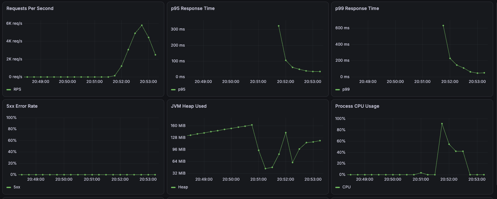

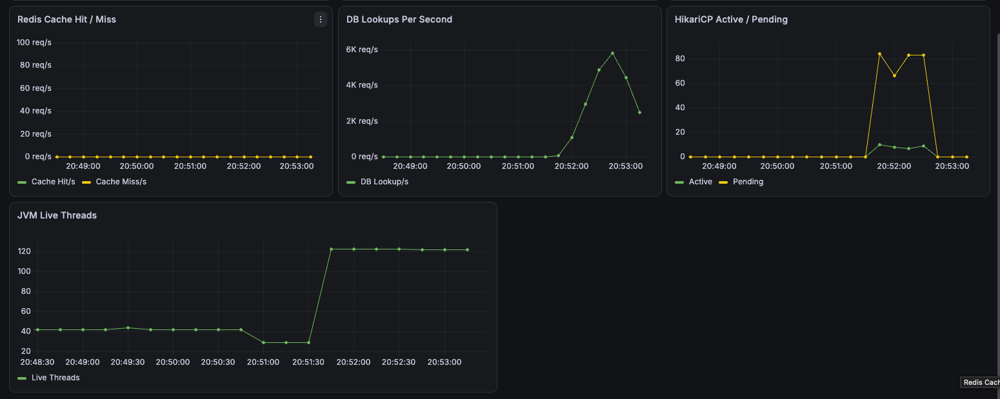

**Virtual Thread**

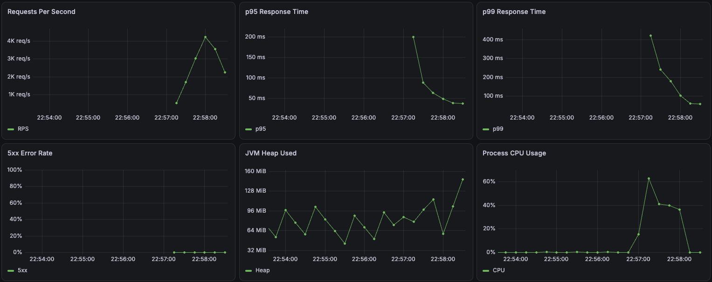

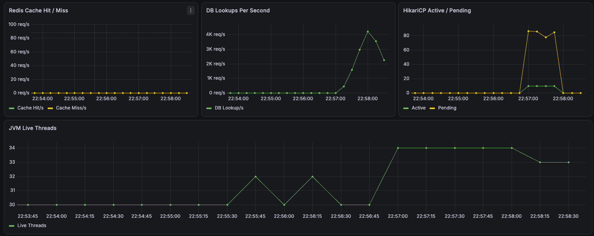

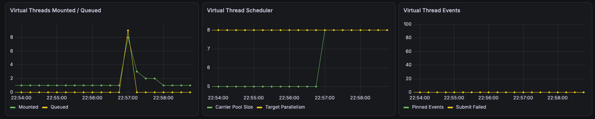

## 14. HikariCP Pool 크기 비교

Thread 비교에서 HikariCP Active가 최대 커넥션 10개에 도달하고
Pending 요청이 발생했다.

커넥션 풀 크기가 실제 처리량과 응답 시간에 미치는 영향을 확인하기 위해
DB Only, Platform Thread, 100 VU, 1분 조건에서
최대 커넥션 수만 5, 10, 20으로 변경했다.

| 지표 | Pool 5 | Pool 10 | Pool 20 |
|---|---:|---:|---:|
| 요청 수 | 341,196 | 466,563 | 438,566 |
| RPS | 5,670.37 | 7,753.05 | 7,288.71 |
| 평균 응답 시간 | 17.47ms | 12.66ms | 13.49ms |
| p95 | 51.37ms | 36.01ms | 38.87ms |
| p99 | 99.99ms | 74.36ms | 70.45ms |
| 최대 응답 시간 | 830.87ms | 598.46ms | 335.53ms |
| 오류율 | 0% | 0% | 0% |

Pool 5에서 Pool 10으로 증가했을 때 처리량이 증가하고
평균, p95, p99 응답 시간이 모두 감소했다.
Pool 5는 100개의 동시 요청을 처리하기에 커넥션 수가 부족했던 것으로 보인다.

반면 Pool 20은 Pool 10보다 p99와 최대 응답 시간은 감소했지만,
RPS가 낮아지고 평균과 p95가 증가했다.

이번 단일 실행에서는 Pool 10이 처리량과 일반적인 응답 지연 측면에서
가장 균형 있는 결과를 보였다.
커넥션 수를 늘린다고 성능이 계속 향상되는 것은 아니며,
동시에 실행되는 쿼리 증가에 따른 DB 경합과 로컬 실행 환경의 변동도
함께 고려해야 한다.

Pool 20 실험에서는 k6 iterations와 DB Lookup이 모두 438,566건으로 일치했다.
Cache Hit과 Cache Miss는 모두 0건이므로
모든 리다이렉트 요청이 MySQL 조회로 처리됐음을 확인했다.

> 조건별 한 번만 실행한 결과이므로 Pool 10을 최적값으로 확정할 수는 없다.
> 정확한 최적값을 결정하려면 조건별 반복 측정과 MySQL 서버 지표가 필요하다.

## 15. Stress Test

DB Only와 Redis Cache Aside 구조에서 VU를 100, 200, 300, 500까지 단계적으로 증가시켰다.

두 구조 모두 Platform Thread와 HikariCP 최대 커넥션 10개를 사용했으며,
캐시 활성화 여부만 변경했다.

### k6 전체 결과

아래 결과는 4분 20초 동안 변화한 모든 VU 구간을 합산한 값이다.

| 지표 | DB Only | Redis |
|---|---:|---:|
| Redirect 요청 수 | 2,123,358 | 4,586,523 |
| 전체 평균 RPS | 8,160.01 | 17,598.13 |
| 평균 응답 시간 | 30.87ms | 13.61ms |
| p90 | 73.64ms | 22.63ms |
| p95 | 90.98ms | 26.75ms |
| 최대 응답 시간 | 389.70ms | 475.44ms |
| 요청 실패율 | 0% | 0% |

Redis 적용 후 DB Only 대비 전체 평균 RPS는 약 115.66% 증가했다.
평균 응답 시간은 약 55.91%, p95는 약 70.60% 감소했다.

최대 응답 시간은 Redis가 더 높았지만,
단일 이상치에 가까운 최대값보다 평균과 p95를 중심으로 결과를 해석했다.

### DB Only 관찰

DB Only는 VU 증가에 따라 초기에는 처리량이 증가했지만,
약 200 VU 이후 RPS가 약 8.5K~9K 수준에서 더 이상 증가하지 않았다.

반면 p95와 p99는 VU가 증가할수록 계속 증가했다.
HikariCP Active는 최대 커넥션 10개에 도달했고,
Pending 요청은 약 180~190까지 증가했다.

따라서 200 VU 이후에는 더 많은 요청을 받아도 처리량이 증가하지 않고,
DB 커넥션을 기다리는 요청만 증가한 것으로 나타났다.

### Redis 관찰

Redis 구조는 VU 증가에 따라 처리량이 약 22K RPS까지 증가했다.
500 VU까지 5xx 오류와 요청 실패는 발생하지 않았다.

전체 Stress Test에서 측정된 캐시 및 DB 지표는 다음과 같다.

| 지표 | 결과 |
|---|---:|
| Cache Hit | 4,586,523 |
| Cache Miss | 1 |
| DB Lookup | 1 |
| Cache Hit Ratio | 약 100% |

최초 조회에서만 Cache Miss와 DB Lookup이 발생했고,
이후 모든 반복 요청은 Redis Cache Hit로 처리됐다.

Prometheus 수집 시점에서는 HikariCP Active와 Pending이 관찰되지 않았다.
Redis 구조도 약 22K RPS 부근에서 처리량 증가가 둔화됐지만,
500 VU까지 오류 없이 DB Only보다 낮은 지연을 유지했다.

### 결과 해석

DB Only는 약 200 VU 이후 HikariCP 커넥션 풀이 포화되면서
처리량이 정체되고 대기 요청이 증가했다.

Redis Cache Aside는 반복적인 DB 조회와 커넥션 대기를 제거해
DB Only보다 약 2.16배 높은 전체 평균 처리량과 낮은 p95를 기록했다.

다만 Redis도 약 22K RPS 부근에서 처리량 증가가 둔화됐으므로,
더 높은 부하에서는 애플리케이션, Redis, 네트워크 또는
로컬 Docker 환경의 다른 제한 요소를 추가로 확인해야 한다.

#### Grafana 측정 결과

**DB Only**

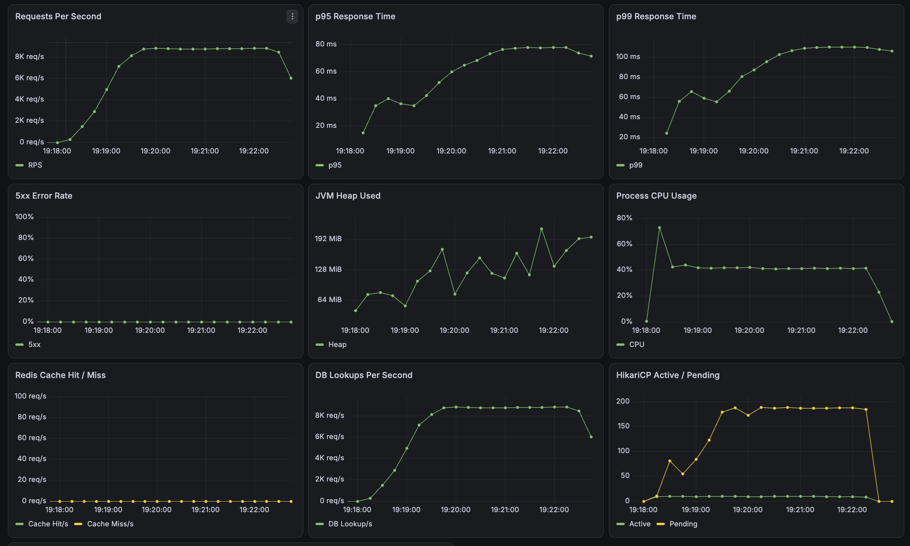

**Redis**

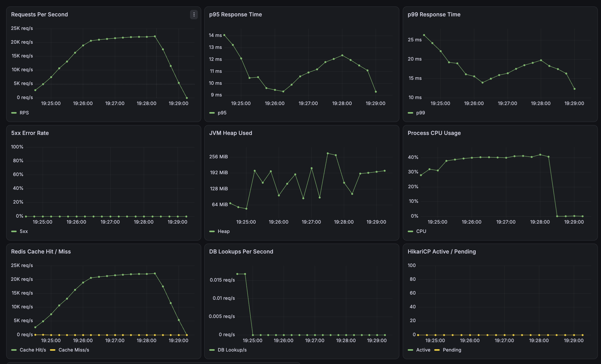

## 16. 단축 코드 생성 전략 비교

단축 코드 생성 방식에 따른 생성 API 성능을 비교했다.

- Sequence ID + Base62
- SHA-256 Hash + Base62
- Snowflake ID + Base62

모든 전략은 Platform Thread, HikariCP 최대 커넥션 10개,
20 VU, 1분 조건에서 측정했다.
실제 신규 생성 경로를 실행하기 위해 요청마다 서로 다른 URL을 사용했다.

| 지표 | Sequence + Base62 | Hash + Base62 | Snowflake + Base62 |
|---|---:|---:|---:|
| 요청 수 | 97,495 | 77,933 | 99,631 |
| RPS | 1,624.60 | 1,298.60 | 1,660.20 |
| 평균 응답 시간 | 12.12ms | 15.18ms | 11.85ms |
| p95 | 22.23ms | 30.14ms | 21.52ms |
| 최대 응답 시간 | 254.82ms | 467.43ms | 274.23ms |
| 실패율 | 0% | 0% | 0% |

각 전략의 저장 흐름은 다음과 같다.

```text
Sequence
INSERT → Auto Increment ID 발급 → Base62 → UPDATE

Hash
중복 코드 SELECT → SHA-256 → Base62 → INSERT

Snowflake
분산 ID 생성 → Base62 → INSERT
```
Snowflake 방식은 단일 실행에서 가장 높은 RPS와
가장 낮은 평균·p95 응답 시간을 기록했다.

Sequence 방식도 Snowflake 방식과 비슷한 성능을 보였지만,
DB에서 ID를 발급받은 후 short_code를 갱신하기 때문에
생성 요청마다 INSERT와 UPDATE가 발생한다.

Hash 방식은 충돌 확인을 위한 조회와 저장 재시도 처리가 필요해
세 전략 중 가장 낮은 처리량과 가장 높은 응답 지연을 기록했다.

Snowflake 방식은 DB ID 발급이나 사전 충돌 조회 없이
한 번의 INSERT로 저장할 수 있다는 장점이 있다.
다만 서버별 nodeId 관리, 시스템 시간 역행 처리,
생성기 동기화와 같은 운영 고려사항이 추가된다.

현재 단일 MySQL 환경에서는 Sequence 방식이 가장 단순하다.
다중 애플리케이션 인스턴스로 확장할 경우에는
DB Auto Increment 의존성이 없는 Snowflake 방식을 적용할 수 있다.

단, 전략별 한 번만 측정했으며 Sequence와 Snowflake의 차이가 작으므로
이번 결과만으로 Snowflake의 성능 우위를 일반화할 수는 없다.

## 17. Redis 장애 시 MySQL Fallback

Redis 장애가 리다이렉트 전체 장애로 이어지지 않도록
Redis GET 실패 시 MySQL로 전환하는 Fallback을 적용했다.

| 항목 | 조건 |
|---|---|
| VU | 100 |
| 실행 시간 | 120초 |
| 정상 | 0~30초 |
| Redis 중지 | 30~60초 |
| 복구 관찰 | 60~120초 |
| Redis Timeout | 200ms |
| HikariCP | 최대 10개 |

### 결과

| 지표 | 결과 |
|---|---:|
| 요청 수 | 656,623 |
| 평균 RPS | 5,471.30 |
| 평균 응답 시간 | 18.09ms |
| 전체 p95 | 31.92ms |
| 최대 응답 시간 | 345.44ms |
| 실패율 | 0% |

Redis 장애 구간에는 GET Error, MySQL Fallback과 DB Lookup이 함께 증가했다.
장애 구간의 p95는 약 200ms, p99는 약 220ms까지 증가했지만
5xx 오류는 발생하지 않았다.

Redis 복구 후 Error, Fallback과 DB Lookup은 다시 0으로 감소했고,
Cache Hit와 응답시간도 정상 수준으로 복귀했다.

이를 통해 Redis 장애 시 성능 저하를 감수하면서 기능을 유지하고,
Redis 복구 후 Cache Aside 경로로 자동 전환되는 것을 확인했다.

현재는 모든 요청이 Redis Timeout을 기다린 뒤 Fallback하므로,
향후 Circuit Breaker를 적용하면 장애 구간의 반복 대기를 줄일 수 있다.

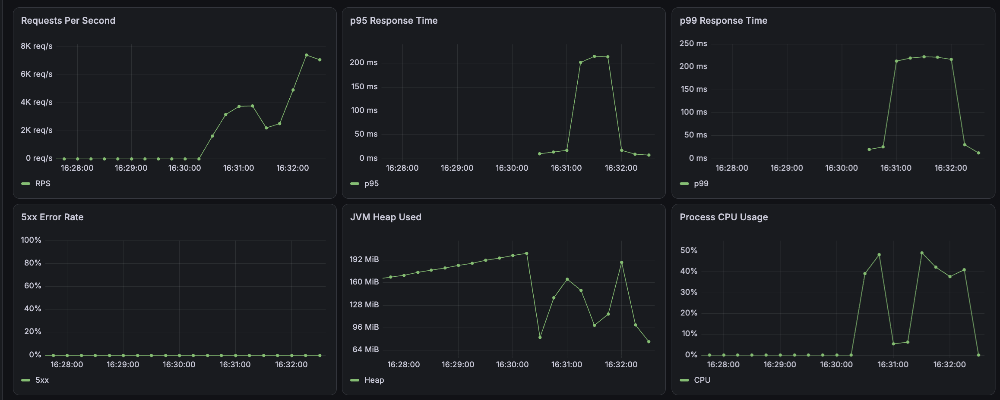

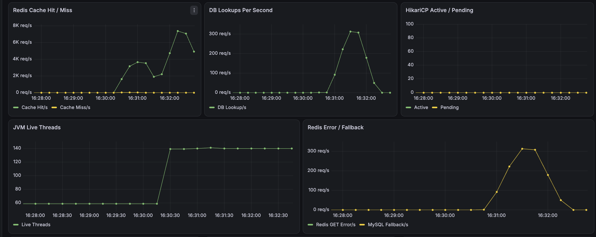

## 18. 다중 인스턴스 및 Failover

단일 애플리케이션 장애가 전체 서비스 장애로 이어지는 문제를 줄이기 위해
App 인스턴스를 2개로 확장하고 Nginx를 통해 요청을 분산했다.

### Snowflake 다중 인스턴스

각 인스턴스에 서로 다른 Snowflake nodeId를 할당했다.

| 인스턴스 | nodeId |
|---|---:|
| App1 | 1 |
| App2 | 2 |

동시 생성 테스트에서 Nginx를 통해 두 인스턴스에 요청이 거의 동일하게 분산됐으며,
생성된 shortCode의 중복 여부를 검증했다.

테스트 과정에서 Snowflake 내부 동시성 문제가 아닌
시스템 Clock Rollback도 확인했다.

```text
App1: backwardMillis=8
App2: backwardMillis=4
```

이에 작은 시간 역행에서는 이전 timestamp로 ID를 생성하지 않고
시계가 마지막 생성 시각까지 복구되기를 기다리도록 처리했다.
큰 시간 역행은 ID 중복 위험을 막기 위해 실패 처리한다.

### 애플리케이션 Failover

100 VU의 리다이렉트 요청을 지속하면서 App1을 강제로 중지한 뒤 다시 실행했다.

| 항목 | 조건 |
|---|---|
| VU | 100 |
| 실행 시간 | 120초 |
| 정상 구간 | 0~30초 |
| App1 중지 | 30~60초 |
| App1 재시작 | 60초 |
| 요청 | GET Redirect |

### 결과

| 지표 | 결과 |
|---|---:|
| 요청 수 | 446,850 |
| 평균 RPS | 3,723.29 |
| 평균 응답 시간 | 26.68ms |
| p95 | 67.40ms |
| 최대 응답 시간 | 2,922.56ms |
| 실패율 | 0% |
| Check 성공률 | 100% |

App1 중지 후 Prometheus의 `up` 값이 0으로 변경됐으며,
App2가 단독으로 리다이렉트 요청을 처리했다.

App1 장애 중에도 전체 요청의 실패율은 0%를 유지했다.
App1 재기동 후 Healthy 상태로 복구됐으며
다시 요청 처리에 참여하는 것도 확인했다.

#### Grafana 측정 결과

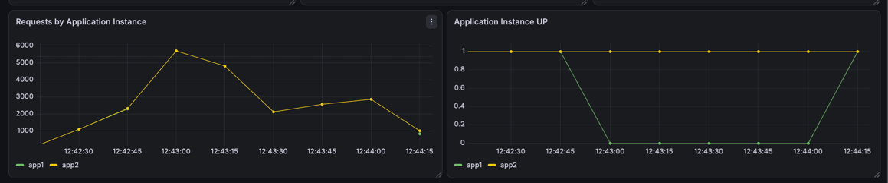

단일 애플리케이션 구조에서는 App 장애가 전체 요청 처리 불가로 이어질 수 있지만,
두 개의 App 인스턴스와 Nginx를 구성한 뒤에는
한 인스턴스가 중단되어도 다른 인스턴스가 요청을 계속 처리했다.

다만 Nginx, MySQL은 여전히 단일 인스턴스이므로
시스템 전체의 SPOF를 제거한 것은 아니다.
이번 실험은 애플리케이션 계층의 단일 장애 지점을 개선하는 데 범위를 한정한다.


## 19. 실험 한계

- 로컬 Docker 환경에서 실행했다.
- k6, 애플리케이션, MySQL, Redis가 같은 장비의 자원을 사용했다.
- 조건별 한 번만 측정해 실행 환경의 변동이 포함될 수 있다.
- Load Test는 조건별 1분, Stress Test는 구조별 4분 20초 동안 실행했다.
- 하나의 단축 URL만 반복 조회했다.
- Prometheus 수집 간격 사이의 짧은 지표 변화는 누락될 수 있다.
- 고정 VU 및 단계적 VU 증가 방식에서는 응답 시간이 짧을수록 더 많은 요청이 발생한다.
- Stress Test의 k6 최종 결과는 모든 VU 구간을 합산한 값이므로, 특정 VU 구간의 값은 Grafana 시계열을 통해 판단했다.
- Redis Stress Test의 처리량 한계가 애플리케이션, Redis 또는 로컬 환경 중 어디에서 발생했는지는 추가로 분리하지 않았다.
- 단축 코드 생성 전략도 조건별 한 번만 측정해 Sequence와 Snowflake의 작은 차이가 실행 환경의 변동인지 확인하지 못했다.
- Redis 장애 실험은 프로세스 중지만 재현했으며 네트워크 지연과 패킷 손실은 검증하지 않았다.
- Redis 장애 중 더 높은 부하에서는 MySQL과 커넥션 풀이 포화될 수 있다.
- 다중 인스턴스 실험은 로컬 Docker 환경에서 App 2개와 Nginx 1개로 수행했으며, 실제 독립 서버 장애를 재현한 것은 아니다.

## 20. 후속 실험

- [x] Redis Cache Aside 적용
- [x] Redis 적용 전후 부하 테스트
- [x] Prometheus·Grafana 서버 지표 비교
- [x] 캐시 ON/OFF 환경변수 적용
- [x] Platform Thread와 Virtual Thread 비교
- [x] HikariCP Pool 크기 비교
- [x] 더 높은 VU로 Stress Test 수행
- [x] Sequence ID + Base62, Hash, Snowflake ID + Base62 비교
- [x] Redis 장애 시 MySQL Fallback 및 자동 복구 검증
- [x] 다중 애플리케이션 인스턴스와 장애 전환 검증
- [ ] Circuit Breaker를 통한 Redis 장애 구간 Timeout 감소
- [ ] Redis Sentinel 또는 Cluster 기반 고가용성 구성
